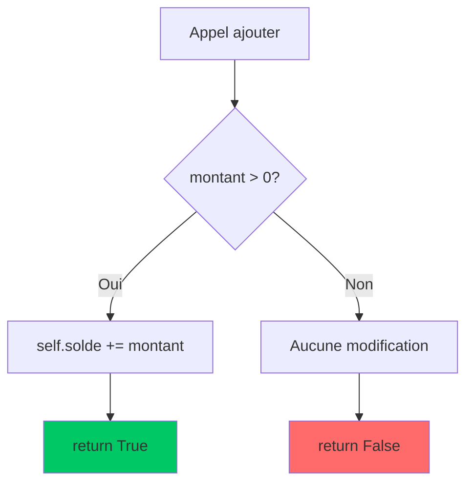
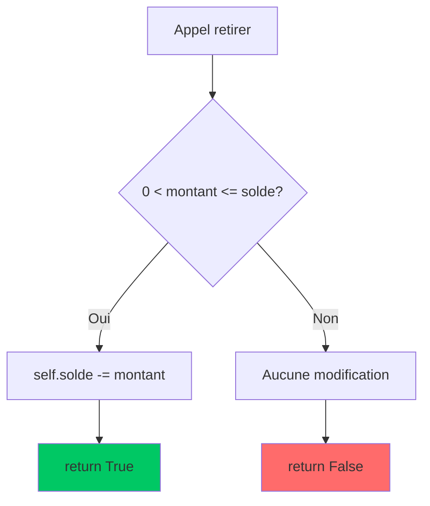
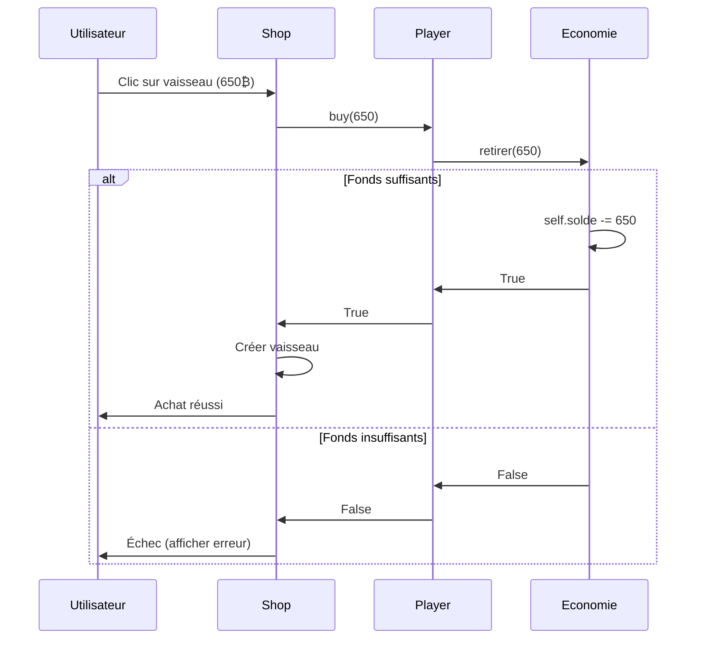
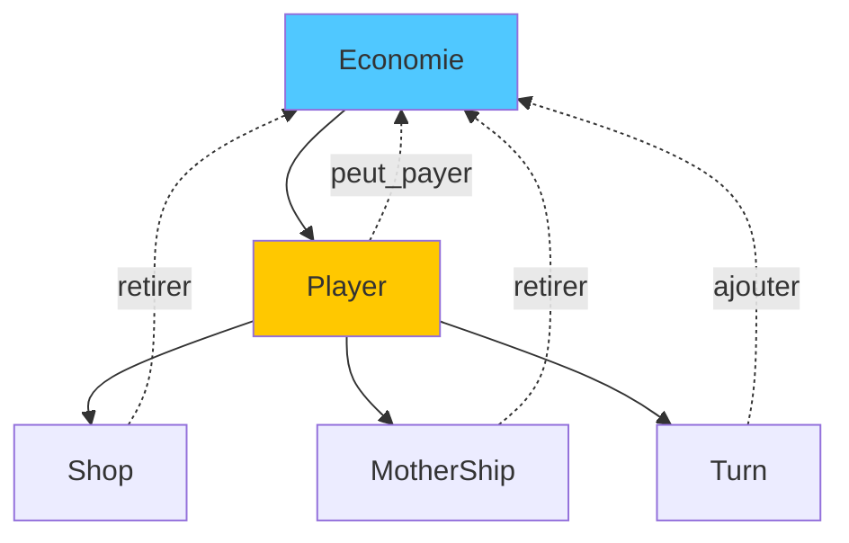

# `Economie`

La classe `Economie` est responsable de la **gestion de la monnaie** d'un joueur dans Xenon Space. Elle fournit une interface simple et sécurisée pour toutes les transactions financières (ajouts, retraits, vérifications).

:::tip Principe de conception
Cette classe suit le principe d'**encapsulation** : le solde est géré de manière centralisée avec des méthodes de contrôle pour éviter les états incohérents (solde négatif, transactions invalides).
:::

---

## 📋 Vue d'ensemble

```python
class Economie:
    def __init__(self, solde_initial=0):
        self.solde = int(solde_initial)
```

**Rôle principal :** Gérer le solde monétaire d'un joueur de manière sécurisée.

**Utilisée par :**
- [`Player`](./Player.md) - Chaque joueur possède une instance `Economie`
- [`Shop`](./Shop.md) - Vérifie et modifie le solde lors d'achats
- [`Turn`](./Turn.md) - Calcule les gains de fin de tour

---

## 🏗️ Constructeur

```python
def __init__(self, solde_initial=0):
    self.solde = int(solde_initial)
```

### Paramètres

| Paramètre | Type | Valeur par défaut | Description |
|-----------|------|-------------------|-------------|
| `solde_initial` | `int` | `0` | Montant d'argent initial du joueur |

### Attributs initialisés

| Attribut | Type | Description |
|----------|------|-------------|
| `self.solde` | `int` | Solde actuel en monnaie du jeu (₿) |

:::info Conversion automatique
Le paramètre est converti en `int` pour éviter les montants avec décimales.
:::

### Exemples d'initialisation

```python
# Joueur débutant
eco1 = Economie()  # solde = 0₿

# Joueur avec capital de départ
eco2 = Economie(500)  # solde = 500₿

# Conversion automatique
eco3 = Economie(999.9)  # solde = 999₿ (tronqué)
```

---

## 💰 Méthodes publiques

### `ajouter`

Ajoute un montant au solde du joueur.

```python
def ajouter(self, montant: int) -> bool:
    """Ajoute de l'argent au solde"""
    if montant > 0:
        self.solde += montant
        return True
    return False
```

#### Paramètres

| Paramètre | Type | Description |
|-----------|------|-------------|
| `montant` | `int` | Montant à ajouter (doit être positif) |

#### Retour

| Type | Valeur | Condition |
|------|--------|-----------|
| `bool` | `True` | L'ajout a réussi (montant > 0) |
| `bool` | `False` | L'ajout a échoué (montant ≤ 0) |

#### Comportement



#### Exemples d'utilisation

```python
eco = Economie(100)

# Ajout valide
eco.ajouter(50)      # True, solde = 150₿
eco.ajouter(200)     # True, solde = 350₿

# Ajouts invalides
eco.ajouter(0)       # False, solde = 350₿ (inchangé)
eco.ajouter(-10)     # False, solde = 350₿ (inchangé)
```

:::tip Validation
La méthode **refuse automatiquement** les montants négatifs ou nuls, évitant les erreurs.
:::

---

### `retirer`

Retire un montant du solde si le joueur a suffisamment de fonds.

```python
def retirer(self, montant: int) -> bool:
    """Retire de l'argent si le joueur a assez"""
    if 0 < montant <= self.solde:
        self.solde -= montant
        return True
    return False
```

#### Paramètres

| Paramètre | Type | Description |
|-----------|------|-------------|
| `montant` | `int` | Montant à retirer (doit être positif et ≤ solde) |

#### Retour

| Type | Valeur | Condition |
|------|--------|-----------|
| `bool` | `True` | Le retrait a réussi (fonds suffisants) |
| `bool` | `False` | Le retrait a échoué (fonds insuffisants ou montant invalide) |

#### Conditions de succès

Le retrait ne s'effectue **que si** :
1. ✅ `montant > 0` (montant strictement positif)
2. ✅ `montant <= self.solde` (fonds suffisants)

#### Comportement



#### Exemples d'utilisation

```python
eco = Economie(500)

# Retraits valides
eco.retirer(100)     # True, solde = 400₿
eco.retirer(400)     # True, solde = 0₿

# Retraits invalides
eco.retirer(50)      # False, solde = 0₿ (insuffisant)
eco.retirer(0)       # False, solde = 0₿ (montant nul)
eco.retirer(-10)     # False, solde = 0₿ (montant négatif)
```

:::caution Protection
La méthode **empêche** le solde de devenir négatif. Un joueur ne peut jamais avoir de dette.
:::

---

### `peut_payer`

Vérifie si le joueur a suffisamment de fonds pour un montant donné **sans modifier le solde**.

```python
def peut_payer(self, montant: int) -> bool:
    """Vérifie si le joueur peut payer"""
    return self.solde >= montant
```

#### Paramètres

| Paramètre | Type | Description |
|-----------|------|-------------|
| `montant` | `int` | Montant à vérifier |

#### Retour

| Type | Valeur | Condition |
|------|--------|-----------|
| `bool` | `True` | Le joueur peut payer (solde ≥ montant) |
| `bool` | `False` | Le joueur ne peut pas payer (solde < montant) |

#### Comportement

```python
# Équivalent à
return self.solde >= montant
```

:::info Méthode de consultation
Cette méthode est **non-destructive** : elle ne modifie jamais le solde.
:::

#### Exemples d'utilisation

```python
eco = Economie(300)

# Vérifications
eco.peut_payer(100)   # True (300 >= 100)
eco.peut_payer(300)   # True (300 >= 300)
eco.peut_payer(301)   # False (300 < 301)
eco.peut_payer(0)     # True (300 >= 0)
eco.peut_payer(-50)   # True (300 >= -50)

# Le solde reste inchangé
print(eco.solde)      # 300₿
```

---

### `etat`

Retourne le solde actuel du joueur.

```python
def etat(self) -> dict:
    return self.solde
```

#### Retour

| Type | Description |
|------|-------------|
| `int` | Solde actuel en monnaie du jeu (₿) |

:::note Signature type
Malgré l'annotation `-> dict`, la méthode retourne en réalité un `int`. Cela semble être une erreur de documentation à corriger.
:::

#### Exemple d'utilisation

```python
eco = Economie(750)

solde = eco.etat()
print(f"Vous avez {solde}₿")  # "Vous avez 750₿"
```

---

## 🔄 Flux d'utilisation typique

### Dans le contexte d'un achat

```python
from classes.Economie import Economie

# Initialisation
eco = Economie(1000)

# 1. Vérifier avant achat (optionnel mais recommandé)
prix = 650
if eco.peut_payer(prix):
    print("Achat possible !")
else:
    print("Fonds insuffisants")
    
# 2. Effectuer le paiement
if eco.retirer(prix):
    print(f"Achat réussi ! Nouveau solde : {eco.etat()}₿")
    # Créer le vaisseau ici
else:
    print("Échec de la transaction")
```

**Sortie :**
```
Achat possible !
Achat réussi ! Nouveau solde : 350₿
```

---

### Dans le contexte de gains

```python
# Gains de fin de tour
gains_planetes = 150
gains_asteroides = 100
recompense_combat = 390

eco.ajouter(gains_planetes)
eco.ajouter(gains_asteroides)
eco.ajouter(recompense_combat)

print(f"Total gagné : {gains_planetes + gains_asteroides + recompense_combat}₿")
print(f"Nouveau solde : {eco.etat()}₿")
```

---

## 🎯 Cas d'usage dans le jeu

### 1. Initialisation des joueurs

```python
from classes.Player import Player

# Dans Player.__init__
class Player:
    def __init__(self, name: str, solde_initial: int = 500):
        self.name = name
        self.economie = Economie(solde_initial)  # ← Instance d'Economie
```

---

### 2. Achat de vaisseau (Shop)

```python
from classes.Shop import Shop

class Shop:
    def buy_ship(self, ship_data):
        prix = ship_data["price"]
        
        # Vérification puis retrait
        if self.player.economie.peut_payer(prix):
            if self.player.economie.retirer(prix):
                return ship_data["name"]  # Achat réussi
        
        return None  # Échec
```

---

### 3. Gains de fin de tour (Player)

```python
class Player:
    def gain(self):
        total_gain = 0
        
        for ship in self.ships:
            if ship.gain > 0:
                total_gain += ship.gain
                ship.gain = 0  # Réinitialiser
        
        # Ajout au solde
        self.economie.ajouter(total_gain)
```

---

### 4. Amélioration de base (MotherShip)

```python
class MotherShip:
    def upgrade(self, payer_fct):
        if not self.can_upgrade():
            return False
        
        price = self.get_next_tier_cost()
        
        # payer_fct est typiquement Player.buy
        if not payer_fct(price):
            return False  # Fonds insuffisants
        
        self.apply_level(self.tier + 1)
        return True
```

Avec dans `Player` :

```python
class Player:
    def buy(self, price: int) -> bool:
        return self.economie.retirer(price)
```

---

## 📊 Diagramme de séquence

### Achat complet



---

## 🛡️ Protection et sécurité

### Protections implémentées

<div className="row">
  <div className="col col--6">
    <div className="alert alert--success">
      <h4>✅ Protections actives</h4>
      <ul>
        <li>Solde ne peut <strong>jamais</strong> être négatif</li>
        <li>Ajouts négatifs/nuls <strong>refusés</strong></li>
        <li>Retraits supérieurs au solde <strong>bloqués</strong></li>
        <li>Conversion automatique en <code>int</code></li>
      </ul>
    </div>
  </div>
  
  <div className="col col--6">
    <div className="alert alert--info">
      <h4>ℹ️ Comportement</h4>
      <ul>
        <li>Méthodes retournent <code>bool</code> pour feedback</li>
        <li>Aucune exception levée (safe)</li>
        <li>État toujours cohérent</li>
        <li>Méthodes atomiques</li>
      </ul>
    </div>
  </div>
</div>

---

### Tests de robustesse

```python
eco = Economie(100)

# Test 1 : Retrait excessif
assert eco.retirer(200) == False  # Refusé
assert eco.solde == 100           # Solde inchangé

# Test 2 : Ajout négatif
assert eco.ajouter(-50) == False  # Refusé
assert eco.solde == 100           # Solde inchangé

# Test 3 : Retrait exact
assert eco.retirer(100) == True   # Accepté
assert eco.solde == 0             # Solde à zéro

# Test 4 : Retrait sur solde nul
assert eco.retirer(1) == False    # Refusé
assert eco.solde == 0             # Reste à zéro
```

---

## 🔍 Cas limites

### Montants négatifs

```python
eco = Economie(500)

# Tentative d'ajout négatif
eco.ajouter(-100)   # False, solde = 500₿ (inchangé)

# peut_payer accepte les montants négatifs (bug logique?)
eco.peut_payer(-10) # True (500 >= -10)
```

:::caution Incohérence
`peut_payer(-10)` retourne `True`, mais `retirer(-10)` retourne `False`. Cela pourrait prêter à confusion.
:::

**Correction suggérée :**

```python
def peut_payer(self, montant: int) -> bool:
    """Vérifie si le joueur peut payer"""
    return montant > 0 and self.solde >= montant
```

---

### Solde à zéro

```python
eco = Economie(0)

# Toutes les opérations de retrait échouent
eco.retirer(1)      # False
eco.retirer(100)    # False

# Les ajouts fonctionnent
eco.ajouter(50)     # True, solde = 50₿
```

---

### Conversion de types

```python
# Float tronqué
eco = Economie(99.9)
print(eco.solde)     # 99 (pas 100)

# Ajout avec float
eco.ajouter(10.7)    # Pas de conversion, pourrait causer une erreur
```

:::caution Type float
Les méthodes n'effectuent **pas de conversion** sur les paramètres. Passer un `float` pourrait causer des bugs.
:::

**Amélioration suggérée :**

```python
def ajouter(self, montant: int) -> bool:
    montant = int(montant)  # Conversion explicite
    if montant > 0:
        self.solde += montant
        return True
    return False
```

---

## 🎓 Exemples avancés

### Pattern de transaction atomique

```python
def transaction_securisee(eco: Economie, prix: int, action_callback):
    """Effectue une transaction avec rollback en cas d'erreur"""
    if not eco.peut_payer(prix):
        return False, "Fonds insuffisants"
    
    if not eco.retirer(prix):
        return False, "Échec du retrait"
    
    try:
        resultat = action_callback()
        return True, resultat
    except Exception as e:
        # Rollback
        eco.ajouter(prix)
        return False, f"Erreur : {e}"

# Utilisation
eco = Economie(1000)
success, msg = transaction_securisee(eco, 650, lambda: creer_vaisseau())
```

---

### Historique des transactions

```python
class EconomieAvecHistorique(Economie):
    def __init__(self, solde_initial=0):
        super().__init__(solde_initial)
        self.historique = []
    
    def ajouter(self, montant: int) -> bool:
        resultat = super().ajouter(montant)
        if resultat:
            self.historique.append(("ajout", montant, self.solde))
        return resultat
    
    def retirer(self, montant: int) -> bool:
        resultat = super().retirer(montant)
        if resultat:
            self.historique.append(("retrait", montant, self.solde))
        return resultat
    
    def afficher_historique(self):
        for type_op, montant, solde_apres in self.historique:
            print(f"{type_op.capitalize()}: {montant}₿ → Solde: {solde_apres}₿")
```

**Utilisation :**

```python
eco = EconomieAvecHistorique(500)
eco.ajouter(150)
eco.retirer(200)
eco.ajouter(100)

eco.afficher_historique()
```

**Sortie :**
```
Ajout: 150₿ → Solde: 650₿
Retrait: 200₿ → Solde: 450₿
Ajout: 100₿ → Solde: 550₿
```

---

## 🧪 Tests unitaires

```python
import unittest

class TestEconomie(unittest.TestCase):
    def setUp(self):
        self.eco = Economie(100)
    
    def test_init(self):
        self.assertEqual(self.eco.solde, 100)
    
    def test_ajouter_valide(self):
        self.assertTrue(self.eco.ajouter(50))
        self.assertEqual(self.eco.solde, 150)
    
    def test_ajouter_invalide(self):
        self.assertFalse(self.eco.ajouter(0))
        self.assertFalse(self.eco.ajouter(-10))
        self.assertEqual(self.eco.solde, 100)
    
    def test_retirer_valide(self):
        self.assertTrue(self.eco.retirer(50))
        self.assertEqual(self.eco.solde, 50)
    
    def test_retirer_invalide(self):
        self.assertFalse(self.eco.retirer(200))
        self.assertEqual(self.eco.solde, 100)
    
    def test_peut_payer(self):
        self.assertTrue(self.eco.peut_payer(100))
        self.assertTrue(self.eco.peut_payer(50))
        self.assertFalse(self.eco.peut_payer(101))
    
    def test_etat(self):
        self.assertEqual(self.eco.etat(), 100)

if __name__ == '__main__':
    unittest.main()
```

---

## 📈 Statistiques d'utilisation

### Fréquence des appels (ordre de grandeur par partie)

| Méthode | Appels typiques | Contexte |
|---------|-----------------|----------|
| `ajouter` | 50-200 | Gains de tour, récompenses |
| `retirer` | 10-50 | Achats de vaisseaux, améliorations |
| `peut_payer` | 20-100 | Vérifications avant achat |
| `etat` | 5-20 | Affichage HUD, debug |

---

## 🔗 Interactions avec d'autres classes



---

## 🎯 Métriques de balance

### Valeurs typiques dans le jeu

| Événement | Montant | Fréquence |
|-----------|---------|-----------|
| **Solde initial** | 500₿ | 1× (début) |
| **Gain base Nv1** | 300₿ | 1×/tour |
| **Gain foreuse/planète** | 150₿ | 1×/tour/foreuse |
| **Gain foreuse/astéroïde** | 100₿ | 1×/tour/foreuse |
| **Coût Petit** | 325₿ | Variable |
| **Coût Moyen** | 650₿ | Variable |
| **Coût Lourd** | 1050₿ | Variable |
| **Upgrade base Nv1→2** | 1000₿ | 1× |

---

## 🔄 Améliorations potentielles

### Version future avec événements

```python
class EconomieAvecEvents(Economie):
    def __init__(self, solde_initial=0):
        super().__init__(solde_initial)
        self.callbacks = {
            "ajout": [],
            "retrait": [],
            "etat_change": []
        }
    
    def on(self, event, callback):
        """Enregistre un callback pour un événement"""
        if event in self.callbacks:
            self.callbacks[event].append(callback)
    
    def ajouter(self, montant: int) -> bool:
        ancien_solde = self.solde
        resultat = super().ajouter(montant)
        
        if resultat:
            for cb in self.callbacks["ajout"]:
                cb(montant, self.solde)
            for cb in self.callbacks["etat_change"]:
                cb(ancien_solde, self.solde)
        
        return resultat
```

**Utilisation :**

```python
eco = EconomieAvecEvents(100)

# Écouter les changements
eco.on("ajout", lambda montant, nouveau: print(f"+{montant}₿"))
eco.on("etat_change", lambda avant, apres: print(f"Solde : {avant} → {apres}₿"))

eco.ajouter(50)
# Sortie:
# +50₿
# Solde : 100 → 150₿
```

---

## 📚 Références

- [Classe Player](./Player.md) - Utilise `Economie` pour gérer le solde
- [Classe Shop](./Shop.md) - Interagit avec `Economie` pour les achats
- [Classe Turn](./Turn.md) - Déclenche les gains via `Economie`
- [MotherShip](./ship/MotherShip.md) - Utilise `Economie` pour les upgrades

---

## 💡 Conseils d'utilisation

<div className="alert alert--success">
  <h4>✅ Bonnes pratiques</h4>
  <ul>
    <li>Toujours vérifier avec <code>peut_payer()</code> avant d'afficher un bouton d'achat</li>
    <li>Vérifier le retour de <code>retirer()</code> pour confirmer la transaction</li>
    <li>Ne jamais modifier <code>self.solde</code> directement</li>
    <li>Utiliser <code>etat()</code> pour l'affichage uniquement</li>
  </ul>
</div>

<div className="alert alert--danger">
  <h4>❌ À éviter</h4>
  <ul>
    <li>Accès direct à <code>economie.solde</code> pour modification</li>
    <li>Ne pas vérifier les valeurs de retour des méthodes</li>
    <li>Supposer qu'un <code>retirer()</code> réussit toujours</li>
    <li>Passer des montants <code>float</code> sans conversion</li>
  </ul>
</div>

---

**Prochaine étape** : Découvrez comment [`Player`](./Player.md) utilise `Economie` pour gérer les finances d'un joueur.