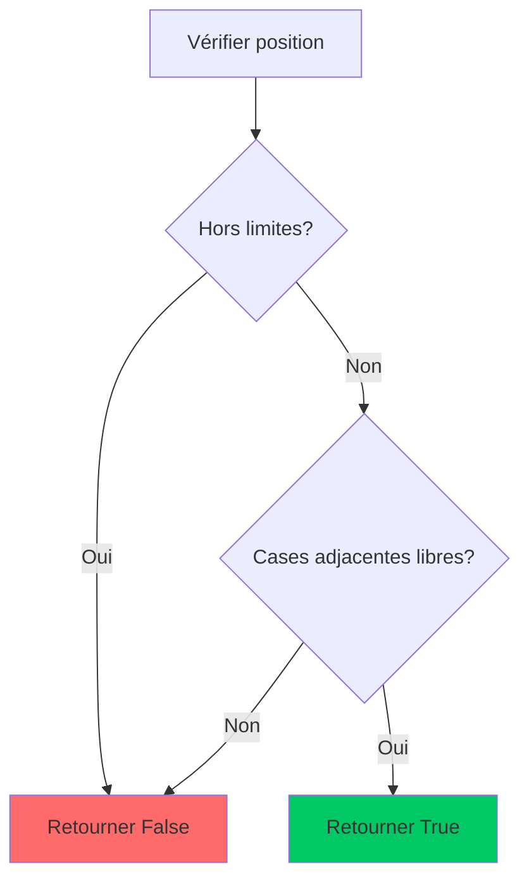
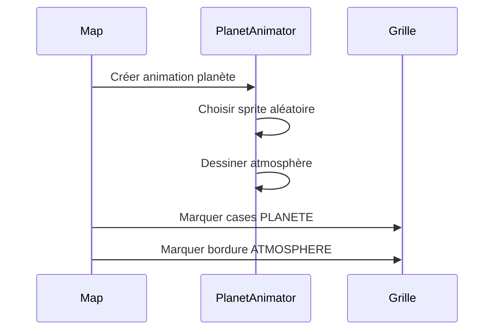
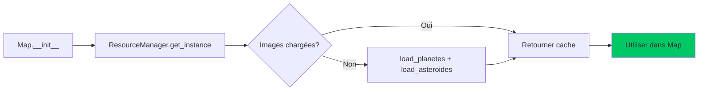
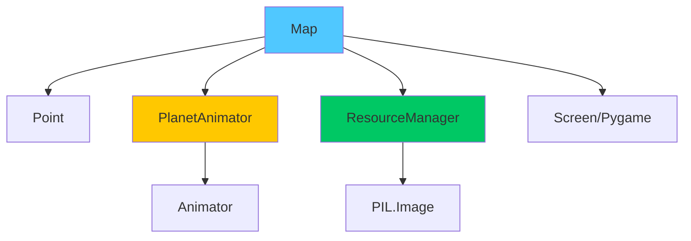

# La map

---

## Vue d'ensemble

La classe **`Map`** est responsable de la génération aléatoire et de la gestion de la carte de jeu de Xenon Space. Elle crée une grille bidimensionnelle composée de différents types de terrain (planètes, astéroïdes, zones de base) et gère leur placement aléatoire tout en respectant des contraintes spatiales.

## Dépendances
```python
import pygame
import random
from classes.Point import Point, Type
from classes.ShipAnimator import ShipAnimator
from classes.Start_Animation.StarField import StarField
from classes.Animator import Animator
from classes.PlanetAnimator import PlanetAnimator
from blazyck import *
from PIL import Image
```

| Dépendance | Utilité |
|------------|---------|
| **`pygame`** | Gestion des surfaces et du rendu graphique |
| **`random`** | Génération aléatoire des positions |
| **`Point`, `Type`** | Représentation des coordonnées et types de cases |
| **`PlanetAnimator`** | Animation des planètes |
| **`blazyck`** | Constantes de configuration globales |
| **`PIL.Image`** | Chargement des ressources graphiques |

---

## Attributs de Classe
```python
class Map:
    nb_cases_x = NB_CASE_X  # Nombre de cases en largeur (défaut: 50)
    nb_cases_y = NB_CASE_Y  # Nombre de cases en hauteur (défaut: 30)
```

Ces attributs définissent les dimensions globales de la grille de jeu.
Elle se base sur les constantes du fichier [blazyck.py](../3-constantes.md).

---

## Constructeur
```python
def __init__(self) -> None:
```

### Initialisation

Le constructeur effectue les opérations suivantes dans l'ordre :

#### 1. Création de la grille
```python
self.grille: list[list[Point]] = [
    [Point(x, y, Type.VIDE) for x in range(self.nb_cases_x)]
    for y in range(self.nb_cases_y)
]
```

Initialise une grille 2D remplie de cases de type `VIDE`.

#### 2. Réservation des zones de base

:::info Zones protégées
Deux zones sont automatiquement réservées pour les bases des joueurs afin d'éviter tout blocage au démarrage.
:::

**Zone Joueur 1 (Haut-Gauche)** : 5×4 cases
```python
for y in range(5):
    for x in range(4):
        self.grille[y][x].type = Type.BASE
```

**Zone Joueur 2 (Bas-Droite)** : 5×4 cases
```python
for y in range(self.nb_cases_y - 5, self.nb_cases_y):
    for x in range(self.nb_cases_x - 4, self.nb_cases_x):
        self.grille[y][x].type = Type.BASE
```

#### 3. Chargement des ressources
```python
from classes.ResourceManager import ResourceManager
resource_manager = ResourceManager()
```

Utilise le **ResourceManager** (pattern Singleton) pour charger les images de planètes et d'astéroïdes pré-chargées, optimisant les performances.

---

## Méthodes Publiques

### `peut_placer`

Vérifie si une planète peut être placée à une position donnée sans collision.
```python
def peut_placer(self, x: int, y: int, taille: int) -> bool:
```

| Paramètre | Type | Description |
|-----------|------|-------------|
| `x` | `int` | Coordonnée X du coin supérieur-gauche |
| `y` | `int` | Coordonnée Y du coin supérieur-gauche |
| `taille` | `int` | Côté de la planète carrée |
| **Retour** | `bool` | `True` si le placement est possible |

#### Logique de Vérification


:::caution Marge de sécurité
La méthode vérifie une zone **étendue d'1 case** autour de la planète pour garantir l'espacement.
:::

#### Contraintes

- ✅ Les cases doivent être de type `VIDE`
- ✅ Marge minimale de 1 case avec les bords de la carte
- ✅ Marge minimale de 1 case avec d'autres objets

---

### `placer_planete`

Place une planète carrée sur la carte avec son atmosphère.
```python
def placer_planete(self, x: int, y: int, taille: int, color_atmosphere=(0, 200, 255)) -> None:
```

| Paramètre | Type | Description |
|-----------|------|-------------|
| `x` | `int` | Coordonnée X |
| `y` | `int` | Coordonnée Y |
| `taille` | `int` | Côté de la planète |
| `color_atmosphere` | `tuple` | Couleur RGB de l'atmosphère (défaut: bleu cyan) |

#### Séquence d'Actions


#### Types de Cases Générées

<div className="row">
  <div className="col col--6">
    <div className="card">
      <div className="card__header">
        <h4>🪐 PLANETE</h4>
      </div>
      <div className="card__body">
        <p>Cases occupées par le corps de la planète</p>
        <p><strong>Blocage :</strong> Infranchissable</p>
      </div>
    </div>
  </div>
  
  <div className="col col--6">
    <div className="card">
      <div className="card__header">
        <h4>🌫️ ATMOSPHERE</h4>
      </div>
      <div className="card__body">
        <p>Cases entourant la planète (1 case)</p>
        <p><strong>Coût :</strong> Déplacement × 2</p>
      </div>
    </div>
  </div>
</div>

---

### `generer_planet`

Génère un nombre spécifié de planètes aléatoires sur la carte.
```python
def generer_planet(self, nb_planet: int) -> None:
```

| Paramètre | Type | Description |
|-----------|------|-------------|
| `nb_planet` | `int` | Nombre de planètes à générer |

#### Algorithme de Génération
```python
pid = 1
essais_max = 2000
essais = 0

while pid <= nb_planet and essais < essais_max:
    essais += 1
    taille = random.randint(3, 6)  # Planètes de 3×3 à 6×6
    x = random.randint(1, self.nb_cases_x - taille - 1)
    y = random.randint(1, self.nb_cases_y - taille - 1)
    
    if self.peut_placer(x, y, taille):
        self.placer_planete(x, y, taille)
        pid += 1
```

:::tip Optimisation
L'algorithme limite le nombre d'essais à **2000** pour éviter les boucles infinies si la carte est saturée.
:::

#### Tailles de Planètes

| Taille | Dimensions | Cases Totales | Probabilité |
|--------|-----------|---------------|-------------|
| Petite | 3×3 | 9 cases | 25% |
| Moyenne | 4×4 | 16 cases | 25% |
| Grande | 5×5 | 25 cases | 25% |
| Très Grande | 6×6 | 36 cases | 25% |

---

### `placer_asteroide`

Place un astéroïde 1×1 à une position donnée.
```python
def placer_asteroide(self, x: int, y: int) -> None:
```

| Paramètre | Type | Description |
|-----------|------|-------------|
| `x` | `int` | Coordonnée X |
| `y` | `int` | Coordonnée Y |

#### Conditions de Placement

- ✅ La case doit être de type `VIDE`
- ✅ Une image d'astéroïde doit être disponible
- ✅ L'image est stockée dans `self.asteroide_img_map`

---

### `generer_asteroides`

Génère un nombre spécifié d'astéroïdes aléatoires.
```python
def generer_asteroides(self, nb_asteroides: int) -> None:
```

| Paramètre | Type | Description |
|-----------|------|-------------|
| `nb_asteroides` | `int` | Nombre d'astéroïdes à placer |

#### Algorithme
```python
essais = 0
max_essais = 2000
placed = 0

while placed < nb_asteroides and essais < max_essais:
    essais += 1
    x = random.randint(0, self.nb_cases_x - 1)
    y = random.randint(0, self.nb_cases_y - 1)
    
    if self.grille[y][x].type == Type.VIDE:
        self.placer_asteroide(x, y)
        placed += 1
```

---

### `generer_grille`

Dessine la grille de jeu sur l'écran avec options d'affichage.
```python
def generer_grille(
    self, 
    screen: pygame.Surface, 
    afficher_zones: bool = False, 
    afficher_grille: bool = True, 
    colors: dict[Type, tuple[int, int, int, int]] = None
) -> None:
```

| Paramètre | Type | Description |
|-----------|------|-------------|
| `screen` | `pygame.Surface` | Surface de rendu |
| `afficher_zones` | `bool` | Afficher les zones colorées par type |
| `afficher_grille` | `bool` | Afficher les lignes de grille |
| `colors` | `dict` | Couleurs RGBA par type de case |

#### Modes d'Affichage


**Affichage par défaut**
- Fond transparent
- Lignes de grille gris foncé (40, 40, 40)
- Planètes et astéroïdes via leurs sprites

**Activer avec SHIFT**
- Fond coloré selon le type de case
- Transparence alpha (128/255)
- Utile pour le développement

Exemple de palette :
```python
colors = {
    Type.VIDE: (0, 0, 0, 0),           # Transparent
    Type.PLANETE: (255, 215, 0, 128),  # Or
    Type.ATMOSPHERE: (0, 200, 255, 128), # Bleu clair
    Type.ASTEROIDE: (255, 215, 0, 128), # Or
    Type.BASE: (100, 100, 125, 128),   # Gris foncé
}
```

---

## Gestion des Ressources avec ResourceManager

:::info Pattern Singleton
Le `ResourceManager` garantit qu'une seule instance existe pour gérer toutes les images.
:::

### Avantages

| Bénéfice | Explication |
|----------|-------------|
| **Performance** | Images chargées une seule fois en mémoire |
| **Cohérence** | Mêmes sprites partagés entre instances |
| **Maintenabilité** | Centralisation du chargement d'assets |

### Workflow de Chargement


---

## Exemples d'Utilisation

### Génération d'une Carte Complète
```python
# Initialisation
map_obj = Map()

# Génération des éléments
map_obj.generer_planet(6)         # 6 planètes
map_obj.generer_asteroides(20)    # 20 astéroïdes

# Affichage
colors = {
    Type.VIDE: (0, 0, 0, 0),
    Type.PLANETE: (255, 215, 0, 128),
    Type.ATMOSPHERE: (0, 200, 255, 128),
    Type.ASTEROIDE: (255, 215, 0, 128),
    Type.BASE: (100, 100, 125, 128),
}

map_obj.generer_grille(screen, False, True, colors)
```

### Vérification de Collision
```python
# Vérifier si une planète 4×4 peut être placée en (10, 15)
if map_obj.peut_placer(10, 15, 4):
    map_obj.placer_planete(10, 15, 4)
    print("✅ Planète placée avec succès")
else:
    print("❌ Position bloquée")
```

---

## Algorithmes et Complexité

### Génération de Planètes

**Complexité Temporelle :** O(n × m) où :
- `n` = nombre de planètes à placer
- `m` = nombre moyen d'essais par planète (< 2000)

**Complexité Spatiale :** O(w × h) où :
- `w` = largeur de la carte
- `h` = hauteur de la carte

### Vérification de Placement

**Complexité :** O(t²) où `t` = taille de la planète
```python
# Pire cas : vérifier une planète 6×6 avec bordure
# = (6+2) × (6+2) = 64 cases à vérifier
```

---

## Cas Particuliers

### Saturation de la Carte

:::caution Limite de Génération
Si trop d'objets sont demandés, l'algorithme s'arrêtera après 2000 essais infructueux par type.
:::

**Exemple :**
```python
map_obj.generer_planet(100)  # Ne placera que ~15-20 planètes sur 50×30
```

### Zones Protégées

Les bases sont **toujours protégées** :
- Aucune planète/astéroïde ne peut spawner dans ces zones
- Garantit un espace libre de 5×4 cases pour chaque joueur

---

## Interactions avec d'Autres Classes


---

## Debugging et Tests

### Script de Test Inclus

Le fichier `Map.py` contient un bloc `if __name__ == "__main__"` pour tester la génération :
```python
if __name__ == "__main__":
    pygame.init()
    screen = pygame.display.set_mode((NB_CASE_X * TAILLE_CASE, NB_CASE_Y * TAILLE_CASE))
    Animator.set_screen(screen)
    
    # Créer fond étoilé
    stars = StarField(screen.get_width(), screen.get_height(), num_stars=100)
    
    # Générer carte
    map_obj = Map()
    map_obj.generer_planet(6)
    map_obj.generer_asteroides(20)
    
    # Boucle de rendu
    running = True
    afficher_grille = False
    
    while running:
        for event in pygame.event.get():
            if event.type == pygame.QUIT:
                running = False
            if event.type == pygame.KEYDOWN:
                if event.key == pygame.K_LCTRL:
                    afficher_grille = not afficher_grille
        
        keys = pygame.key.get_pressed()
        afficher_zones = keys[pygame.K_LSHIFT]
        
        screen.fill((0, 0, 0))
        stars.update()
        stars.draw(screen)
        map_obj.generer_grille(screen, afficher_zones, afficher_grille, colors)
        
        pygame.display.flip()
        clock.tick(60)
```

### Contrôles de Test

| Touche | Action |
|--------|--------|
| **CTRL** | Toggle grille |
| **SHIFT** | Afficher zones colorées |
| **ÉCHAP** | Quitter |

---

## Limitations Connues

| Limitation | Impact | Solution |
|------------|--------|----------|
| **Essais Max** | Blocage si carte saturée | Augmenter `max_essais` ou réduire le nombre d'objets |
| **Tailles Fixes** | Planètes toujours carrées | Implémenter des formes irrégulières |
| **Pas de Seed** | Génération non reproductible | Ajouter `random.seed()` en paramètre |

---

## Bonnes Pratiques

<div className="alert alert--success">
  <h4>✅ Recommandations</h4>
  <ul>
    <li>Générer les planètes **avant** les astéroïdes</li>
    <li>Utiliser 4-8 planètes pour un bon équilibre</li>
    <li>Ratio astéroïdes : 1.5× le nombre de cases de planètes</li>
    <li>Toujours appeler `Animator.set_screen()` avant d'utiliser Map</li>
  </ul>
</div>

---

## Changelog et Évolutions Futures

### Version Actuelle
- ✅ Génération procédurale de planètes et astéroïdes
- ✅ Protection des zones de base
- ✅ Système d'atmosphère autour des planètes
- ✅ Pré-chargement des ressources via ResourceManager

### Améliorations Prévues
- 🔄 Génération basée sur seed (reproductible)
- 🔄 Support de formes de planètes non carrées
- 🔄 Biomes différents (planètes de glace, lave, etc.)
- 🔄 Génération de "chemins" garantis entre bases

---

## Références

- [Classe Point](./Point.md)
- [Enum Type](./Point.md)
- [PlanetAnimator](./animation/2-PlanetAnimator.md)
- [ResourceManager](./1-principale_class.md)