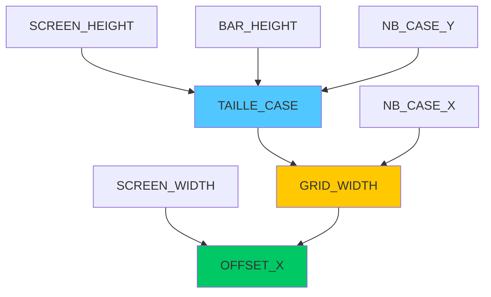

# Constantes de Configuration (`blazyck.py`)

Le fichier `blazyck.py` est le **fichier de configuration central** de Xenon Space. Il centralise toutes les constantes et paramètres globaux du jeu, permettant des ajustements rapides sans modifier le code des classes.

:::tip Principe de conception
Ce fichier suit le principe **DRY (Don't Repeat Yourself)** : toutes les valeurs magiques sont définies une seule fois et réutilisées partout.
:::

---

## 📋 Vue d'ensemble

```python
import os
import pygame

# Constantes

pygame.init()
info = pygame.display.Info()
SCREEN_WIDTH = info.current_w
SCREEN_HEIGHT = info.current_h
pygame.quit()
```

Le fichier s'organise en **7 sections principales** :

1. **Dimensions d'écran** - Résolution et offsets
2. **Interface utilisateur** - Shop et HUD
3. **Grille de jeu** - Taille de la carte
4. **Ressources graphiques** - Planètes et animations
5. **Chemins de fichiers** - Organisation des assets
6. **Paramètres de gameplay** - Statistiques et récompenses
7. **Configuration externe** - Discord RPC

---

## 📺 Dimensions d'écran

### Détection automatique

```python
pygame.init()
info = pygame.display.Info()
SCREEN_WIDTH = info.current_w
SCREEN_HEIGHT = info.current_h
pygame.quit()
```

| Constante | Type | Description |
|-----------|------|-------------|
| `SCREEN_WIDTH` | `int` | Largeur de l'écran en pixels (détectée automatiquement) |
| `SCREEN_HEIGHT` | `int` | Hauteur de l'écran en pixels (détectée automatiquement) |

:::info Résolutions courantes
- **1920×1080** (Full HD)
- **2560×1440** (2K)
- **3840×2160** (4K)
:::

---

## 🛒 Interface utilisateur (Shop/HUD)

```python
# Shop
BAR_HEIGHT = 85
ICON_SIZE = 50
ICON_MARGIN = 20
CASE_PADDING = 8
```

### Constantes du shop

| Constante | Valeur | Unité | Utilisation |
|-----------|--------|-------|-------------|
| `BAR_HEIGHT` | `85` | px | Hauteur de la barre du shop en bas de l'écran |
| `ICON_SIZE` | `50` | px | Taille des icônes de vaisseaux |
| `ICON_MARGIN` | `20` | px | Espacement entre les icônes |
| `CASE_PADDING` | `8` | px | Marge intérieure des cases d'icônes |

**Schéma de disposition :**

```
┌─────────────────────────────────────────┐
│                                         │ ← SCREEN_HEIGHT - BAR_HEIGHT
│        Zone de jeu (grille)             │
│                                         │
├─────────────────────────────────────────┤
│ [Icon] [Icon] [Icon] [Icon] [Icon]     │ ← BAR_HEIGHT (85px)
│   ↑      ↑                               │
│  50px   20px (marge)                    │
└─────────────────────────────────────────┘
```

:::caution Interdépendance
Modifier `BAR_HEIGHT` affecte la taille disponible pour la grille de jeu !
:::

---

## 🗺️ Grille de jeu

```python
# Taille de la map
NB_CASE_X = 50  # Nombre de cases en largeur
NB_CASE_Y = 30  # Nombre de cases en hauteur
TAILLE_CASE = (SCREEN_HEIGHT - BAR_HEIGHT) // NB_CASE_Y  # Taille d'une case en pixels

# Adapté l'écran
GRID_WIDTH = NB_CASE_X * TAILLE_CASE
OFFSET_X = max((SCREEN_WIDTH - GRID_WIDTH) // 2, 100)
```

### Constantes de la carte

| Constante | Valeur | Type | Description |
|-----------|--------|------|-------------|
| `NB_CASE_X` | `50` | `int` | Nombre de colonnes (largeur de la carte) |
| `NB_CASE_Y` | `30` | `int` | Nombre de lignes (hauteur de la carte) |
| `TAILLE_CASE` | Calculé | `int` | Taille d'une case en pixels |
| `GRID_WIDTH` | Calculé | `int` | Largeur totale de la grille en pixels |
| `OFFSET_X` | Calculé | `int` | Décalage horizontal pour centrer la grille |

### Calcul de `TAILLE_CASE`

```python
TAILLE_CASE = (SCREEN_HEIGHT - BAR_HEIGHT) // NB_CASE_Y
```

**Exemple de calcul (1080p) :**
```
Hauteur disponible = 1080 - 85 = 995px
TAILLE_CASE = 995 // 30 = 33px
```

:::tip Résolution adaptative
La taille des cases s'ajuste automatiquement à la résolution de l'écran !
:::

### Calcul de `OFFSET_X`

```python
OFFSET_X = max((SCREEN_WIDTH - GRID_WIDTH) // 2, 100)
```

**Objectif :** Centrer la grille horizontalement (minimum 100px de marge).

**Exemple (1920px de large) :**
```
GRID_WIDTH = 50 × 33 = 1650px
OFFSET_X = max((1920 - 1650) // 2, 100) = max(135, 100) = 135px
```

---

## 🪐 Ressources graphiques

### Animations de planètes

```python
# Planètes
MAX_PLANETES_ANIMATIONS = 50  # Nombre d'animations de planètes différents
PLANETES_FRAME_SIZE = (75, 75)  # Taille d'une frame de planètes
```

| Constante | Valeur | Description |
|-----------|--------|-------------|
| `MAX_PLANETES_ANIMATIONS` | `50` | Nombre de spritesheets de planètes disponibles (`planet1.png` à `planet50.png`) |
| `PLANETES_FRAME_SIZE` | `(75, 75)` | Dimensions en pixels d'une frame individuelle dans les spritesheets de planètes |

:::info Format des spritesheets
Chaque fichier `planetX.png` contient plusieurs frames de 75×75px disposées horizontalement.
:::

---

## 📁 Chemins de fichiers

```python
# Chemain des fichiers
BASE_DIR = os.path.dirname(__file__)  # Chemain du dossier du projet
IMG_PATH = os.path.join(BASE_DIR, "assets", "img")
PLANETES_PATH = os.path.join(IMG_PATH, "planets")
PROJECTILES_PATH = os.path.join(IMG_PATH, "projectiles")
ASTEROIDES_PATH = os.path.join(IMG_PATH, "asteroides")
```

### Hiérarchie des chemins

| Constante | Chemin relatif | Contenu |
|-----------|---------------|---------|
| `BASE_DIR` | `.` | Racine du projet |
| `IMG_PATH` | `./assets/img/` | Dossier principal des images |
| `PLANETES_PATH` | `./assets/img/planets/` | Spritesheets des planètes |
| `PROJECTILES_PATH` | `./assets/img/projectiles/` | Animations des projectiles |
| `ASTEROIDES_PATH` | `./assets/img/asteroides/` | Images d'astéroïdes |

### Structure attendue

```
xenon-space/
├── blazyck.py
└── assets/
    └── img/
        ├── planets/
        │   ├── planet1.png
        │   ├── planet2.png
        │   └── ...
        ├── projectiles/
        │   ├── bullet.png
        │   ├── laser.png
        │   └── ...
        └── asteroides/
            ├── aste1.png
            ├── aste2.png
            └── ...
```

:::caution Chemins absolus
`BASE_DIR` utilise `__file__` pour garantir des chemins corrects **même si le script est lancé depuis un autre dossier**.
:::

---

## ⚙️ Paramètres de gameplay

### Constante multiplicatrice

```python
# Stats des vaisseaux
CSTE : int = 10
```

| Constante | Valeur | Utilisation |
|-----------|--------|-------------|
| `CSTE` | `10` | Constante multiplicatrice (usage spécifique à implémenter) |

:::note Usage futur
Cette constante semble être un placeholder pour des calculs de balance à implémenter.
:::

---

### Récompenses et gains

```python
# Gains
PLANETES_REWARD = 150
ASTEROIDES_REWARD = 100
POURCENT_DEATH_REWARD = 0.6
```

| Constante | Valeur | Type | Description |
|-----------|--------|------|-------------|
| `PLANETES_REWARD` | `150` | `int` | Argent gagné par tour si une foreuse est adjacente à une planète |
| `ASTEROIDES_REWARD` | `100` | `int` | Argent gagné par tour si une foreuse est adjacente à un astéroïde |
| `POURCENT_DEATH_REWARD` | `0.6` | `float` | Pourcentage du coût d'un vaisseau ennemi reçu en récompense lors de son élimination |

#### Exemples de calcul

**Foreuse sur planète :**
```python
gain_par_tour = PLANETES_REWARD  # 150₿
```

**Foreuse sur astéroïde :**
```python
gain_par_tour = ASTEROIDES_REWARD  # 100₿
```

**Élimination d'un vaisseau Moyen (650₿) :**
```python
recompense = 650 * POURCENT_DEATH_REWARD  # 390₿
```

:::tip Balance économique
Modifier ces valeurs impacte **fortement** l'équilibre économique du jeu !
:::

---

## 🌐 Configuration externe

### Discord Rich Presence

```python
RPC_ID = "1419749281190903848"
```

| Constante | Valeur | Description |
|-----------|--------|-------------|
| `RPC_ID` | `"1419749281190903848"` | Identifiant de l'application Discord pour la Rich Presence |

:::info Rich Presence
Permet d'afficher l'activité de jeu dans le profil Discord du joueur (ex : "En partie", "Au menu principal").
:::

**Utilisation dans le code :**

```python
from blazyck import RPC_ID
from classes.Discord import DiscordRP

discord = DiscordRP(RPC_ID)
discord.connect()
discord.update(state="En jeu")
```

---

## 🧪 Script de test

Le bloc de test en bas du fichier vérifie que les chemins sont correctement configurés :

```python
if __name__ == "__main__":
    print("\n" + IMG_PATH)
```

**Exécution :**
```bash
python blazyck.py
```

**Sortie attendue :**
```
/chemin/vers/xenon-space/assets/img
```

---

## 📊 Tableau récapitulatif

### Catégories de constantes

| Catégorie | Nombre | Constantes |
|-----------|--------|-----------|
| **Écran** | 2 | `SCREEN_WIDTH`, `SCREEN_HEIGHT` |
| **Interface** | 4 | `BAR_HEIGHT`, `ICON_SIZE`, `ICON_MARGIN`, `CASE_PADDING` |
| **Grille** | 5 | `NB_CASE_X`, `NB_CASE_Y`, `TAILLE_CASE`, `GRID_WIDTH`, `OFFSET_X` |
| **Ressources** | 2 | `MAX_PLANETES_ANIMATIONS`, `PLANETES_FRAME_SIZE` |
| **Chemins** | 5 | `BASE_DIR`, `IMG_PATH`, `PLANETES_PATH`, `PROJECTILES_PATH`, `ASTEROIDES_PATH` |
| **Gameplay** | 4 | `CSTE`, `PLANETES_REWARD`, `ASTEROIDES_REWARD`, `POURCENT_DEATH_REWARD` |
| **Externe** | 1 | `RPC_ID` |

---

## 🔧 Comment modifier les constantes

### Exemple 1 : Changer la taille de la carte

```python
# Avant
NB_CASE_X = 50
NB_CASE_Y = 30

# Après (carte plus grande)
NB_CASE_X = 70
NB_CASE_Y = 40
```

:::caution Impact
- Augmente la mémoire utilisée
- Réduit `TAILLE_CASE` (cases plus petites)
- Allonge la durée des parties
:::

---

### Exemple 2 : Augmenter les récompenses

```python
# Avant
PLANETES_REWARD = 150
ASTEROIDES_REWARD = 100

# Après (économie plus généreuse)
PLANETES_REWARD = 200
ASTEROIDES_REWARD = 150
```

:::tip Balance
Tester plusieurs valeurs pour trouver l'équilibre économique idéal !
:::

---

### Exemple 3 : Ajuster l'interface

```python
# Avant
BAR_HEIGHT = 85
ICON_SIZE = 50

# Après (shop plus compact)
BAR_HEIGHT = 70
ICON_SIZE = 40
```

---

## 🔗 Utilisation dans le code

### Import global

```python
from blazyck import *

# Utilisation directe
largeur = SCREEN_WIDTH
nb_cases = NB_CASE_X
taille = TAILLE_CASE
```

### Import sélectif

```python
from blazyck import NB_CASE_X, NB_CASE_Y, TAILLE_CASE

# Plus explicite
grille = [[None for _ in range(NB_CASE_X)] for _ in range(NB_CASE_Y)]
```

---

## ⚠️ Bonnes pratiques

<div className="alert alert--success">
  <h4>✅ À faire</h4>
  <ul>
    <li>Utiliser ces constantes **partout** dans le code</li>
    <li>Documenter les modifications avec des commentaires</li>
    <li>Tester le jeu après chaque modification</li>
    <li>Garder une copie de sauvegarde avant de changer les valeurs</li>
  </ul>
</div>

<div className="alert alert--danger">
  <h4>❌ À éviter</h4>
  <ul>
    <li>Utiliser des valeurs codées en dur dans les autres fichiers</li>
    <li>Modifier sans comprendre les dépendances</li>
    <li>Définir des constantes contradictoires (ex: `NB_CASE_X = 0`)</li>
    <li>Oublier de relancer le jeu après modification</li>
  </ul>
</div>

---

## 🎯 Cas d'usage courants

### 1. Support de nouvelles résolutions

```python
# Ajout de contraintes min/max
SCREEN_WIDTH = max(info.current_w, 1280)  # Min 1280px
SCREEN_HEIGHT = max(info.current_h, 720)  # Min 720px
```

### 2. Mode fenêtré vs plein écran

```python
# Mode fenêtré
WINDOW_WIDTH = 1280
WINDOW_HEIGHT = 720

# Calculer offset pour centrer
OFFSET_X = (WINDOW_WIDTH - GRID_WIDTH) // 2
```

### 3. Debug avec une petite carte

```python
# Version dev (plus rapide)
NB_CASE_X = 20
NB_CASE_Y = 15
```

---

## 📈 Dépendances entre constantes



**Ordre de dépendance :**
1. `SCREEN_HEIGHT` et `SCREEN_WIDTH` (détectés)
2. `TAILLE_CASE` (dépend de `SCREEN_HEIGHT`, `BAR_HEIGHT`, `NB_CASE_Y`)
3. `GRID_WIDTH` (dépend de `TAILLE_CASE`, `NB_CASE_X`)
4. `OFFSET_X` (dépend de `SCREEN_WIDTH`, `GRID_WIDTH`)

---

## 🔍 Debugging

### Afficher toutes les valeurs

```python
if __name__ == "__main__":
    print("=== Configuration Xenon Space ===")
    print(f"Écran: {SCREEN_WIDTH}×{SCREEN_HEIGHT}")
    print(f"Grille: {NB_CASE_X}×{NB_CASE_Y} cases")
    print(f"Taille case: {TAILLE_CASE}px")
    print(f"Offset X: {OFFSET_X}px")
    print(f"Shop: hauteur={BAR_HEIGHT}, icône={ICON_SIZE}")
    print(f"Chemins:")
    print(f"  IMG: {IMG_PATH}")
    print(f"  Planètes: {PLANETES_PATH}")
    print(f"Récompenses:")
    print(f"  Planète: {PLANETES_REWARD}₿")
    print(f"  Astéroïde: {ASTEROIDES_REWARD}₿")
    print(f"  Élimination: {POURCENT_DEATH_REWARD*100}%")
```

---

## 📚 Références

- [Documentation Map](./classes/Map.md) - Utilisation de `NB_CASE_X/Y`, `TAILLE_CASE`
- [Documentation Shop](./classes/Shop.md) - Utilisation de `BAR_HEIGHT`, `ICON_SIZE`
- [Documentation Discord](./classes/Discord.md) - Utilisation de `RPC_ID`

---

## 🔄 Changelog et évolutions

### Version actuelle
- ✅ Détection automatique de résolution
- ✅ Chemins relatifs robustes
- ✅ Constantes de gameplay configurables

### Améliorations futures
- 🔄 Support multi-résolutions (presets)
- 🔄 Fichier de config externe (JSON/YAML)
- 🔄 Validation automatique des valeurs
- 🔄 Mode debug avec valeurs alternatives

---

**Prochaine étape** : Découvrez comment ces constantes sont utilisées dans les [Classes Principales](./classes/principale_class.md).