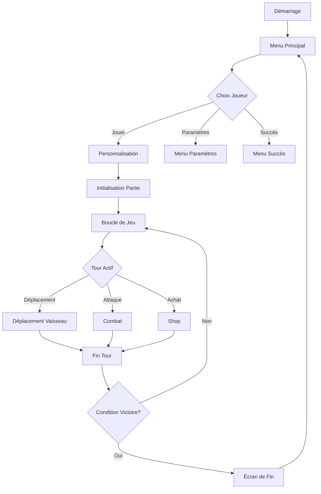

# Introduction à Xenon Space

Bienvenue dans la documentation technique de **Xenon Space**, un jeu de stratégie spatial tour par tour développé en Python avec Pygame.

## Navigation de la Documentation

- **[Initialisation et installation des dépendences](./requirements.md)**
- **[Classes Principales](./classes/principale_class.md)** : Documentation des classes
- **[Maintenance du projet](./maintenance.md)**

## Vue d'ensemble

Xenon Space est un jeu de stratégie spatial où deux joueurs s'affrontent pour le contrôle de ressources spatiales limitées. Le jeu propose :

- **Système de combat tour par tour** avec différents types de vaisseaux
- **Gestion de ressources** (planètes, astéroïdes)
- **Économie dynamique** avec boutique de vaisseaux
- **Système de base évolutif** (MotherShip améliorable)
- **Animations fluides** avec système d'animateurs personnalisés

## Architecture Générale

### Structure du Projet

```
xenon-space/
├── assets/               # Ressources graphiques et audio
│   ├── img/
│   │   ├── ships/       # Sprites des vaisseaux
│   │   ├── planets/     # Animations des planètes
│   │   ├── projectiles/ # Animations des projectiles
│   │   └── menu/        # Ressources de l'interface
│   ├── sounds/          # Effets sonores et musiques
│   └── fonts/           # Polices personnalisées
├── classes/             # Classes principales du jeu
│   ├── Ship.py          # Classe de base des vaisseaux
│   ├── MotherShip.py    # Vaisseau-mère
│   ├── Player.py        # Gestion des joueurs
│   ├── Map.py           # Génération de carte
│   ├── Turn.py          # Système de tours
│   ├── Animator.py      # Système d'animation de base
│   └── ...
├── menu/                # Système de menus
│   ├── menuPrincipal.py
│   ├── menuJouer.py
│   └── ...
├── main.py              # Point d'entrée du jeu
└── blazyck.py           # Configuration globale
```

## Concepts Clés

### 1. Système de Tour

Le jeu utilise une classe statique `Turn` qui gère l'alternance entre joueurs :

```python
Turn.players = [Player("Alice"), Player("Bob")]
Turn.next()  # Passe au joueur suivant
```

### 2. Grille de Jeu

La carte est représentée par une grille 2D de `Point` avec différents types :

```python
class Type(Enum):
    VIDE = 0
    PLANETE = 1
    ASTEROIDE = 3
    VAISSEAU = 5
```

### 3. Animation Basée sur Frames

Chaque élément animé hérite de la classe `Animator` :

```python
animator = ShipAnimator(path, dimensions, coord)
animator.play("engine")  # Lance une animation
animator.update_and_draw()  # Met à jour et affiche
```

### 4. Économie

Chaque joueur possède une instance `Economie` pour gérer ses ressources :

```python
player.economie.ajouter(150)  # Ajoute de l'argent
player.buy(500)  # Tente un achat
```

:::info[*Pour plus d'info*]
Voir la partie [Classe Principales](./classes/principale_class.md)
:::

## Flux de Jeu Principal



## Contributeurs

- [VOITURIER Noa](https://github.com/nonov1012)
- [NOËL Clément](https://github.com/Reclea)
- [DAVID Gabriel](https://github.com/NockXu)
- [DUPUIS Brian](https://github.com/brian62100)
- [CAVEL Ugo](https://github.com/GitLovox)
- VANHOVE Tom

## Licence

Copyright © 2025 - Tous droits réservés
