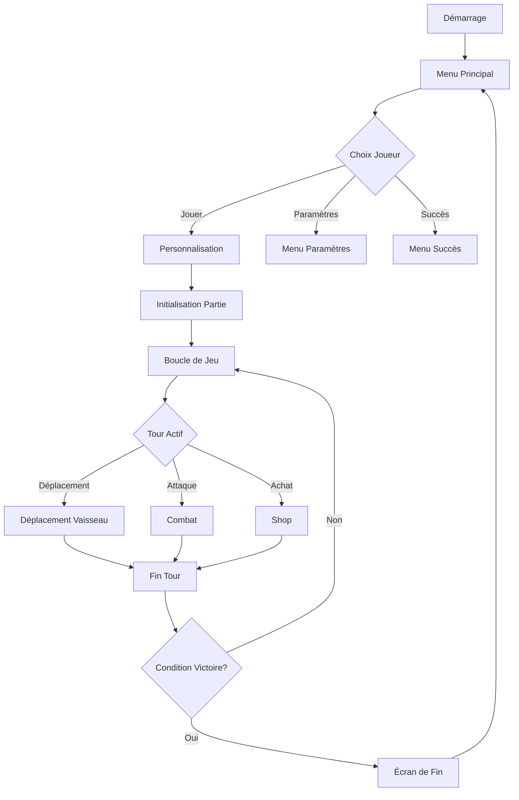

# Introduction à Xenon Space

Bienvenue dans la documentation technique de **Xenon Space**, un jeu de stratégie spatial tour par tour développé en Python avec Pygame.

<!-- [img]: Capture d'écran du jeu en action -->

## 🎮 Vue d'ensemble

Xenon Space est un jeu de stratégie spatial où deux joueurs s'affrontent pour le contrôle de ressources spatiales limitées. Le jeu propose :

- **Système de combat tour par tour** avec différents types de vaisseaux
- **Gestion de ressources** (planètes, astéroïdes)
- **Économie dynamique** avec boutique de vaisseaux
- **Système de base évolutif** (MotherShip améliorable)
- **Animations fluides** avec système d'animateurs personnalisés

## 🏗️ Architecture Générale

### Structure du Projet

```
xenon-space/
├── assets/               # Ressources graphiques et audio
│   ├── img/
│   │   ├── ships/       # Sprites des vaisseaux
│   │   ├── planets/     # Animations des planètes
│   │   ├── projectiles/ # Animations des projectiles
│   │   └── menu/        # Ressources de l'interface
│   ├── sounds/          # Effets sonores et musiques
│   └── fonts/           # Polices personnalisées
├── classes/             # Classes principales du jeu
│   ├── Ship.py         # Classe de base des vaisseaux
│   ├── MotherShip.py   # Vaisseau-mère
│   ├── Player.py       # Gestion des joueurs
│   ├── Map.py          # Génération de carte
│   ├── Turn.py         # Système de tours
│   ├── Animator.py     # Système d'animation de base
│   └── ...
├── menu/                # Système de menus
│   ├── menuPrincipal.py
│   ├── menuJouer.py
│   └── ...
├── main.py              # Point d'entrée du jeu
└── blazyck.py           # Configuration globale
```

## 🛠️ Technologies Utilisées

### Bibliothèques Principales

| Bibliothèque | Version | Usage |
|--------------|---------|-------|
| **Pygame** | 2.x | Moteur graphique et gestion des événements |
| **Pillow (PIL)** | - | Traitement d'images (conversion GIF) |
| **NumPy** | - | Calculs mathématiques pour animations |
| **pypresence** | - | Intégration Discord Rich Presence |

### Dépendances Système

- Python 3.8+
- Pygame avec support SRCALPHA (transparence)
- Environnement graphique (X11/Wayland/Windows)

## 🎯 Concepts Clés

### 1. Système de Tour

Le jeu utilise une classe statique `Turn` qui gère l'alternance entre joueurs :

```python
Turn.players = [Player("Alice"), Player("Bob")]
Turn.next()  # Passe au joueur suivant
```

### 2. Grille de Jeu

La carte est représentée par une grille 2D de `Point` avec différents types :

```python
class Type(Enum):
    VIDE = 0
    PLANETE = 1
    ASTEROIDE = 3
    VAISSEAU = 5
```

### 3. Animation Basée sur Frames

Chaque élément animé hérite de la classe `Animator` :

```python
animator = ShipAnimator(path, dimensions, coord)
animator.play("engine")  # Lance une animation
animator.update_and_draw()  # Met à jour et affiche
```

### 4. Économie

Chaque joueur possède une instance `Economie` pour gérer ses ressources :

```python
player.economie.ajouter(150)  # Ajoute de l'argent
player.buy(500)  # Tente un achat
```

## 📊 Flux de Jeu Principal



## 🚀 Démarrage Rapide

### Installation

```bash
# Cloner le dépôt
git clone https://github.com/votre-repo/xenon-space.git
cd xenon-space

# Installer les dépendances
pip install pygame pillow numpy pypresence

# Lancer le jeu
python main.py
```

### Premier Lancement

1. **Écran de chargement** : Les ressources (planètes, astéroïdes) sont préchargées
2. **Menu principal** : Navigation avec animations de fond spatial
3. **Personnalisation** : Configuration de la partie avant de jouer
4. **Jeu** : Partie en tour par tour

## 📚 Navigation de la Documentation

- **[Architecture](./architecture/overview.md)** : Détails sur l'architecture du jeu
- **[Classes Principales](./core-classes/ship.md)** : Documentation des classes core
- **[Systèmes de Jeu](./game-systems/turn-system.md)** : Mécaniques de gameplay
- **[Animation](./animation/animator.md)** : Système d'animation
- **[Interface](./ui/hud.md)** : Composants UI
- **[Guides](./guides/creating-ships.md)** : Tutoriels de développement

## 🤝 Contributeurs

- VOITURIER Noa
- NOËL Clément  
- DAVID Gabriel
- DUPUIS Brian
- CAVEL Ugo
- VANHOVE Tom

## 📄 Licence

Copyright © 2025 - Tous droits réservés

---

**Prochaine étape** : [Architecture Overview →](./architecture/overview.md)