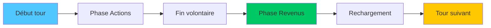
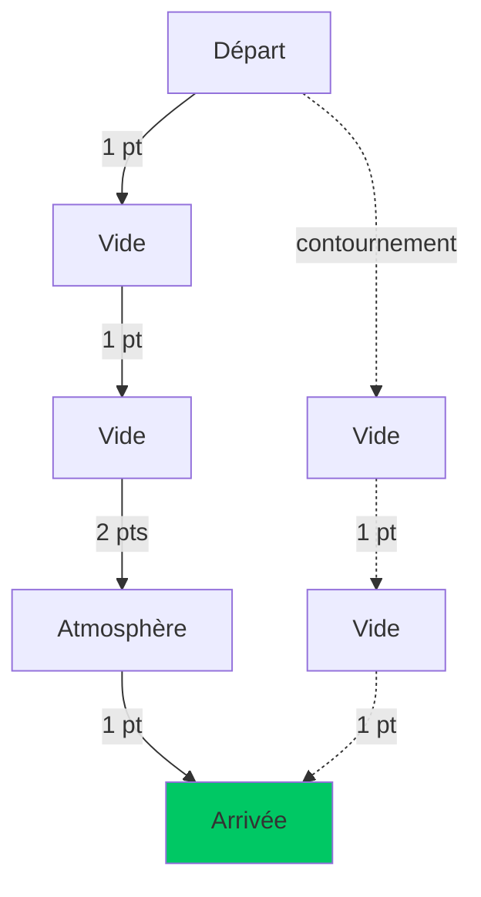
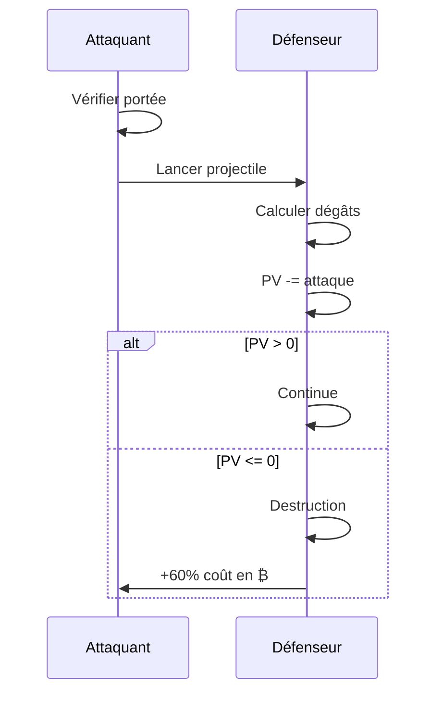

import Tabs from '@theme/Tabs';
import TabItem from '@theme/TabItem';

# 🎮 Gameplay

Guide complet des **règles** et **mécaniques de jeu** de Xenon Space.

---

## 🎯 Objectif et victoire

### Condition de victoire

<div className="hero hero--success">
  <div className="container">
    <h3 className="hero__title">🏆 Victoire</h3>
    <p className="hero__subtitle">
      Détruisez le <strong>vaisseau-mère ennemi</strong> (PV = 0)
    </p>
  </div>
</div>

### Condition de défaite

<div className="hero hero--danger">
  <div className="container">
    <h3 className="hero__title">💀 Défaite</h3>
    <p className="hero__subtitle">
      Si votre <strong>vaisseau-mère</strong> est détruit (PV = 0)
    </p>
  </div>
</div>

:::info Partie terminée
Dès qu'un vaisseau-mère est détruit, la partie se termine immédiatement.
:::

---

## 🔄 Déroulement d'un tour

### Séquence complète



<Tabs>
  <TabItem value="actions" label="1️⃣ Phase Actions" default>

**Vous pouvez :**
- 🏃 Déplacer vos vaisseaux
- ⚔️ Attaquer les ennemis
- ⛏️ Miner des astéroïdes
- 💰 Acheter des vaisseaux
- 🏰 Améliorer votre base
- 🚚 Embarquer/débarquer (transporteur)
- ↻ Faire pivoter vos vaisseaux

**Ordre libre :** Vous choisissez l'ordre des actions !

:::tip Flexibilité
Vous pouvez acheter → déplacer → acheter → attaquer dans n'importe quel ordre.
:::

  </TabItem>
  
  <TabItem value="fin" label="2️⃣ Fin de tour">

**Appuyez sur ENTRÉE** quand vous avez terminé.

:::caution Irréversible
Une fois validé, impossible de revenir en arrière !
:::

  </TabItem>
  
  <TabItem value="revenus" label="3️⃣ Phase Revenus">

**Gains automatiques :**

| Source | Montant | Conditions |
|--------|---------|------------|
| 🏰 Base | 300-450₿ | Selon niveau (1-4) |
| ⛏️ Foreuse | 150₿ | Si adjacente à une planète |
| 💀 Élimination | 60% coût | Ennemi détruit ce tour |

:::info Calcul
Ces revenus s'ajoutent **automatiquement** à votre argent.
:::

  </TabItem>
  
  <TabItem value="rechargement" label="4️⃣ Rechargement">

**Tous vos vaisseaux récupèrent :**
- ✅ Portée de déplacement complète
- ✅ Portée d'attaque complète

Les PV **ne se régénèrent pas** automatiquement.

  </TabItem>
</Tabs>

---

## 🚀 Déplacement

### Système de portée

Chaque vaisseau a une **portée de déplacement** (points de mouvement).

**Exemples :**
- Petit : 6 points
- Moyen : 6 points
- Lourd : 2 points
- Foreuse : 3 points
- Transporteur : 4 points

---

### Coût du terrain

Le coût dépend du type de case traversée :

<div className="row">
  <div className="col col--6">
    <div className="card">
      <div className="card__header">
        <h4>⬛ Vide</h4>
      </div>
      <div className="card__body">
        <p><strong>Coût :</strong> 1 point</p>
        <p>Déplacement normal, optimal</p>
      </div>
    </div>
  </div>
  
  <div className="col col--6">
    <div className="card">
      <div className="card__header">
        <h4>🌫️ Atmosphère</h4>
      </div>
      <div className="card__body">
        <p><strong>Coût :</strong> 2 points</p>
        <p>Zone autour des planètes</p>
      </div>
    </div>
  </div>
</div>

:::tip Calcul pratique
**Petit vaisseau (6 pts) :**
- 6 cases vides OU
- 3 cases atmosphère OU
- 4 vides + 1 atmosphère
:::

---

### Algorithme de pathfinding

Le jeu utilise **A\*** pour calculer automatiquement le meilleur chemin.



**Avantages :**
- ✅ Évite automatiquement les obstacles
- ✅ Trouve le chemin le moins coûteux
- ✅ Respecte les limites de portée

:::info Intelligence
Vous n'avez pas besoin de calculer le chemin case par case !
:::

---

### Restrictions

**Un vaisseau NE peut PAS :**
- ❌ Traverser une planète
- ❌ Traverser un astéroïde
- ❌ Traverser un autre vaisseau
- ❌ Se déplacer si portée = 0
- ❌ Sortir de la carte

---

## ⚔️ Combat

### Système d'attaque



---

### Dégâts et PV

**Calcul simple :**
```
PV_restants = PV_actuels - Attaque_ennemie
```

**Exemple :**
- Vaisseau Moyen : 400 PV
- Attaqué par Petit : 50 ATK
- PV restants : 400 - 50 = **350 PV**

:::caution Pas de défense
Il n'y a **pas de statistique de défense**. Tous les dégâts sont appliqués intégralement.
:::

---

### Portée d'attaque

La portée d'attaque utilise la **distance de Manhattan** :

```
Distance = |x1 - x2| + |y1 - y2|
```

**Exemples visuels :**

```
Portée 3 autour d'un vaisseau (V) :

  . . 3 . .
  . 3 2 3 .
  3 2 1 2 3
  . 3 2 3 .
  . . 3 . .
```

:::info Zone carrée
Les vaisseaux peuvent attaquer dans **toutes les directions** (pas seulement devant).
:::

---

### Élimination et récompense

Quand vous détruisez un vaisseau ennemi :

**Récompense :** `60% du coût du vaisseau`

| Vaisseau détruit | Coût | Récompense |
|------------------|------|------------|
| Petit | 325₿ | **195₿** |
| Moyen | 650₿ | **390₿** |
| Grand | 1050₿ | **630₿** |
| Foreuse | 400₿ | **240₿** |
| Transporteur | 500₿ | **300₿** |

:::tip Stratégie
Détruire les vaisseaux ennemis **finance** votre propre armée !
:::

---

## ⛏️ Minage et ressources

### Miner un astéroïde

**Conditions :**
- Avoir une **Foreuse**
- Astéroïde dans la **zone rouge** (portée attaque)
- **Clic droit** sur l'astéroïde

**Résultat :**
- ✅ Astéroïde disparaît
- 💰 Gain immédiat : **+75₿**
- ⚠️ Foreuse perd 10% PV

:::caution Dégâts
Le minage **endommage** la foreuse ! Surveillez ses PV.
:::

---

### Bonus planètes

Les foreuses **adjacentes à une planète** génèrent des revenus passifs.

**Mécanisme :**
1. Placez une foreuse à côté d'une planète (1 case)
2. À chaque fin de tour : **+150₿ automatique**
3. Cumulable (plusieurs foreuses = plusieurs bonus)

```
🪐 = Planète
⛏️ = Foreuse
. = Vide

Configuration optimale :
  . ⛏️ .
  ⛏️ 🪐 ⛏️
  . ⛏️ .
  
4 foreuses = 600₿/tour !
```

:::tip Stratégie économique
C'est la **source de revenus la plus rentable** à long terme !
:::

---

## 💰 Économie

### Sources de revenus

<Tabs>
  <TabItem value="base" label="🏰 Base" default>

**Revenu passif par tour**

| Niveau | PV  | Gain/tour | Coût upgrade |
|--------|-----|-----------|--------------|
|   1    | 500 |   300₿    |    1000₿     |
| 2 | 700 | 350₿ | 2000₿ |
| 3 | 1200 | 400₿ | 6000₿ |
| 4 | 1600 | 450₿ | — |

**ROI (Return on Investment) :**

<ul>
  <li>Nv1→2 : 20 tours (1000₿ / 50₿)</li>
  <li>Nv2→3 : 40 tours (2000₿ / 50₿)</li>
  <li>Nv3→4 : 120 tours (6000₿ / 50₿)</li>
</ul>

</TabItem>
  
  <TabItem value="foreuses" label="⛏️ Foreuses">

**Deux modes de gain**

**1. Minage actif :**

<ul>
  <li>+75₿ immédiat</li>
  <li>Coûte 10% PV</li>
  <li>Une fois par astéroïde</li>
</ul>

**2. Bonus planète (passif) :**

<ul>
  <li>+150₿ par tour</li>
  <li>Aucun coût</li>
  <li>Infini</li>
</ul>

:::tip Comparaison
Bonus planète > Minage actif après seulement 1 tour !
:::

  </TabItem>
  
  <TabItem value="combat" label="💀 Combat">

**Récompenses d'élimination**

```
Gain = 60% × Coût_vaisseau
```

**Stratégie :**

<ul>
  <li>Ciblez les vaisseaux **chers** (Lourds, Transporteurs)</li>
  <li>Les éliminations financent vos achats</li>
  <li>Effet boule de neige si bien géré</li>
</ul>

  </TabItem>
</Tabs>

---

### Gestion du budget

**Conseils :**

<div className="row">
  <div className="col col--6">
    <div className="alert alert--success">
      <h4>✅ Bonnes pratiques</h4>
      <ul>
        <li>Investir dans 2-3 foreuses rapidement</li>
        <li>Améliorer la base progressivement</li>
        <li>Garder une réserve (500₿+)</li>
        <li>Diversifier la flotte</li>
      </ul>
    </div>
  </div>
  
  <div className="col col--6">
    <div className="alert alert--danger">
      <h4>❌ Erreurs courantes</h4>
      <ul>
        <li>Tout dépenser en combat</li>
        <li>Ignorer les foreuses</li>
        <li>Upgrader trop tôt au Nv4</li>
        <li>Acheter que des Petits</li>
      </ul>
    </div>
  </div>
</div>

---

## 🚚 Transport

### Système de transport

Le **Transporteur** peut embarquer jusqu'à **3 vaisseaux** :

**Capacité :**

<ul>
  <li>3× Petit</li>
  <li>1× Moyen + 1× Petit</li>
  <li>1× Lourd (occupe 2 slots)</li>
</ul>

:::info Configuration
Vous pouvez personnaliser le nombre de slots dans les paramètres avancés.
:::

---

### Embarquer un vaisseau

**Procédure :**

<ul>
  <ol>Déplacez le vaisseau **adjacent** au transporteur</ol>
  <ol>**Clic droit** sur le transporteur</ol>
  <ol>Le vaisseau disparaît et entre dans la cargaison</ol>
</ul>

**Mini-icônes :**
Des petites icônes apparaissent **au-dessus** du transporteur pour montrer la cargaison.

<!--  -->

---

### Débarquer un vaisseau

**Procédure :**

<ul>
  <ol>**Clic droit** sur une mini-icône de vaisseau</ol>
  <ol>Des **zones jaunes** apparaissent autour du transporteur</ol>
  <ol>**Cliquez** sur une zone jaune</ol>
  <ol>Le vaisseau est déployé</ol>
</ul>

:::caution Portée limitée
Le débarquement utilise la portée de **déplacement** du vaisseau débarqué !
:::

---

### Stratégies avec le transport

<Tabs>
  <TabItem value="colonisation" label="🌍 Colonisation" default>

**Foreuses rapides**

  <ul>
    <li>Embarquer 3 foreuses</li>
    <li>Les déployer sur des planètes éloignées</li>
    <li>Gain : 450₿/tour sur zone lointaine</li>
  </ul>

  </TabItem>
  
  <TabItem value="assault" label="⚔️ Assaut">

**Strike team**
<ul>
  <li>Embarquer 2 vaisseaux lourds</li>
  <li>Approche rapide de la base ennemie</li>
  <li>Débarquement surprise</li>
</ul>

  </TabItem>
  
  <TabItem value="retreat" label="🏃 Retraite">

**Évacuation**

<ul>
  <li>Sauver un vaisseau endommagé</li>
  <li>Le ramener à la base</li>
  <li>Éviter l'élimination</li>
</ul>

  </TabItem>
</Tabs>

---

## 🔄 Rotation des vaisseaux

### Mécanique

Appuyez sur **R** pour faire pivoter un vaisseau sélectionné de **90°**.

**Ordre de rotation :**
```
Haut → Droite → Bas → Gauche → Haut
```

---

### Restrictions

**Conditions pour pivoter :**

<ul>
  <li>✅ Espace suffisant dans la nouvelle orientation</li>
  <li>✅ Pas d'obstacle à la position finale</li>
  <li>❌ Impossible si bloqué</li>
</ul>

**Calcul de position :**
Le centre du vaisseau reste fixe, seule l'orientation change.

```
Vaisseau 2x3 :

Vertical (haut) :    Horizontal (droite) :
  A A                  A B C
  B B                  A B C
  C C
```

:::tip Utilité
La rotation permet de **passer dans des espaces étroits** entre planètes !
:::

---

## 📊 Statistiques des vaisseaux

### Tableau comparatif

| Vaisseau | PV | ATK | P.Att | P.Dép | Coût | Taille |
|----------|----|----|-------|-------|------|--------|
| 🏃 **Petit** | 100 | 50 | 3 | 6 | 325₿ | 1×1 |
| ⚖️ **Moyen** | 400 | 100 | 5 | 6 | 650₿ | 2×2 |
| 🛡️ **Lourd** | 800 | 200 | 7 | 2 | 1050₿ | 3×4 |
| ⛏️ **Foreuse** | 200 | 0 | 0 | 3 | 400₿ | 1×1 |
| 🚚 **Transport** | 600 | 100 | 3 | 4 | 500₿ | 2×2 |
| 🏰 **Base Nv1** | 500 | 0 | 0 | 0 | — | 4×5 |

:::info Personnalisation
Ces valeurs peuvent être modifiées dans l'onglet "Vaisseaux" du menu personnalisation.
:::

---

## 🎯 Mécaniques avancées

### Contrôle de zone

**Principe :**
Placer des vaisseaux pour **bloquer** les mouvements ennemis.

```
Exemple de blocus :

  🪐 . . . 🏰(Ennemi)
  . 🚀 . 🚀 .
  . . 🚀 . .
  
Vos 3 vaisseaux empêchent l'accès direct à la base.
```

---

### Focus fire

**Technique :**
Concentrer **plusieurs attaques** sur une seule cible pour l'éliminer rapidement.

**Avantages :**

<ul>
  <li>✅ Réduit la menace immédiatement</li>
  <li>✅ Récupère la récompense</li>
  <li>✅ Diminue la puissance de feu ennemie</li>
</ul>

:::tip Priorités
Focus les **Lourds** et **Moyens** d'abord (menace + récompense).
:::

---

### Kiting

**Technique :**
Attaquer puis reculer pour éviter les contre-attaques.

**Exemple avec Petit (6 dép, 3 att) :**
<ul>
  <ol>Avancer de 3 cases</ol>
  <ol>Attaquer (portée 3)</ol>
  <ol>Au tour suivant, reculer de 6 cases</ol>
  <ol>L'ennemi ne peut pas contre-attaquer</ol>
</ul>


---

### Trading

**Principe :**
Échanger un vaisseau **peu coûteux** contre un ennemi **cher**.

**Exemple :**

<ul>
  <li>Sacrifier un Petit (325₿)</li>
  <li>Pour éliminer un Lourd ennemi (1050₿)</li>
  <li>Gain net : 630₿ - 325₿ = **+305₿**</li>
</ul>

:::caution Calculez bien
N'échangez que si le gain est **positif** !
:::

---

## 🏆 Conditions spéciales

### Partie nulle

:::info Impossibilité
Il est **impossible** d'avoir une partie nulle dans Xenon Space. Un des deux joueurs gagnera toujours.
:::

---

### Abandon

**Menu pause (ÉCHAP) → Quitter**

:::caution Pas de sauvegarde
Quitter une partie **ne la sauvegarde pas**. Elle sera perdue.
:::

---

## 📖 Récapitulatif des règles

<div className="card">
  <div className="card__header">
    <h3>📋 Règles essentielles</h3>
  </div>
  <div className="card__body">
    <ol>
      <li><strong>Objectif :</strong> Détruire le vaisseau-mère ennemi</li>
      <li><strong>Tour par tour :</strong> Alternance entre joueurs</li>
      <li><strong>Actions libres :</strong> Ordre non imposé</li>
      <li><strong>Déplacement :</strong> Coûte 1-2 pts selon terrain</li>
      <li><strong>Combat :</strong> Dégâts = Attaque (pas de défense)</li>
      <li><strong>Économie :</strong> Base + Foreuses + Éliminations</li>
      <li><strong>Portées :</strong> Se rechargent à chaque tour</li>
      <li><strong>PV :</strong> Ne se régénèrent pas</li>
    </ol>
  </div>
</div>

---

## 🎓 Quiz de compréhension

<details>
<summary><strong>Question 1 :</strong> Combien de cases peut parcourir un Petit dans l'atmosphère ?</summary>

**Réponse :** 3 cases

**Explication :** Portée 6 ÷ Coût 2 = 3 cases

</details>

<details>
<summary><strong>Question 2 :</strong> Combien gagne-t-on en détruisant un vaisseau Moyen (650₿) ?</summary>

**Réponse :** 390₿

**Explication :** 60% × 650₿ = 390₿

</details>

<details>
<summary><strong>Question 3 :</strong> Quelle est la source de revenus la plus rentable ?</summary>

**Réponse :** Foreuses sur planètes

**Explication :** 150₿/tour passif, sans risque ni coût

</details>

---

## 🔄 Prochaines étapes

<div className="hero hero--primary">
  <div className="container">
    <h3 className="hero__title">🚀 Approfondissez</h3>
    <p className="hero__subtitle">
      Découvrez en détail chaque type de vaisseau et leur utilisation optimale !
    </p>
    <a href="/vaisseaux" className="button button--secondary button--lg">
      Guide des Vaisseaux →
    </a>
  </div>
</div>