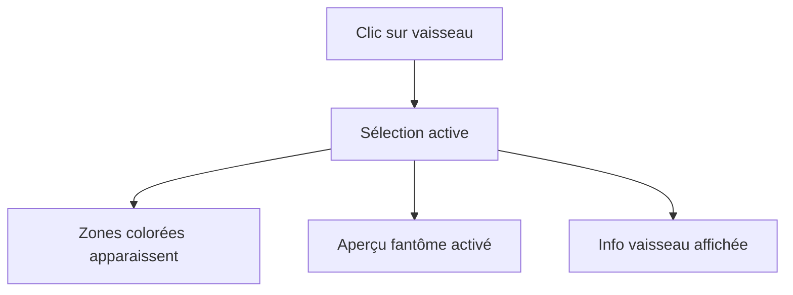
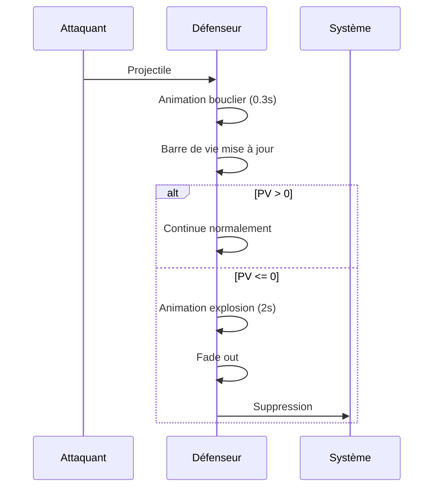

# 🖥️ Interface de jeu

Guide complet de l'interface de Xenon Space pour maîtriser tous les éléments visuels.

---

## Vue d'ensemble

L'interface est conçue pour être **intuitive** tout en offrant toutes les informations nécessaires.


:::info Disposition
L'écran est divisé en **5 zones principales** numérotées de 1 à 5 sur le schéma.
:::

---

## 1️⃣ Barres de statut des joueurs

### Barre gauche - Joueur 1 (Vous)

<div className="row">
  <div className="col col--8">

La barre gauche affiche vos statistiques en temps réel :

**Composition :**
- **En haut** : 💰 Argent disponible (₿)
- **Centre** : Barre de vie du vaisseau-mère
- **En bas** : PV actuels / PV maximum

**Code couleur vie :**
- 🟢 Vert : >70% PV
- 🟡 Orange : 30-70% PV
- 🔴 Rouge : <30% PV

  </div>
  <div className="col col--4">
    <div className="alert alert--info">
      <h4>💡 Exemple</h4>
      <p><strong>₿ 1,850</strong></p>
      <p className="progress-bar" style={{background: 'linear-gradient(to right, #00ff00 80%, #333 80%)'}}>
        ████████░░
      </p>
      <p><strong>800 / 1000</strong></p>
    </div>
  </div>
</div>

---

### Effet joueur actif

Le joueur dont c'est le tour a une **animation lumineuse** autour de sa barre :

```css
/* Effet visuel */
- Contour lumineux pulsant
- Couleur cyan brillante
- Animation de glow
```


:::tip Repère visuel
Vous savez immédiatement **qui joue** grâce à cet effet !
:::

---

### Barre droite - Joueur 2 (Adversaire)

Même disposition que la barre gauche, mais affiche les stats de l'ennemi.

**Utilité :**
- 👁️ Surveiller l'économie adverse
- ⚔️ Évaluer la solidité de sa base
- 📊 Planifier vos attaques

---

## 2️⃣ Indicateur de tour

Centré en haut de l'écran, cet élément affiche :

<div className="card" style={{maxWidth: '300px', margin: '0 auto'}}>
  <div className="card__body text--center">
    <h3>TOUR 5</h3>
    <p><strong>Alice</strong></p>
  </div>
</div>

**Informations :**
- 📅 **Numéro du tour** - Commence à 1
- 👤 **Nom du joueur actif** - Défini au lancement

:::note Importance
Le numéro de tour vous aide à évaluer la progression de la partie (économie, tech, etc.)
:::

---

## 3️⃣ Carte de jeu

### Vue d'ensemble

La carte occupe **l'essentiel de l'écran** et contient tous les éléments de gameplay.

**Dimensions par défaut :**
- **50 x 30 cases** (configurable)
- Taille adaptative selon résolution
- Zone centrale scrollable si nécessaire

---

### Légende des éléments

import Tabs from '@theme/Tabs';
import TabItem from '@theme/TabItem';

<Tabs>
  <TabItem value="terrain" label="🗺️ Terrain" default>

| Élément | Visuel | Propriétés |
|---------|--------|------------|
| ⬛ **Vide** | Espace noir | Déplacement : 1 pt |
| 🌫️ **Atmosphère** | Halo bleu autour planètes | Déplacement : 2 pts |
| 🪐 **Planète** | Sphère animée | Infranchissable, bonus foreuses |
| ☄️ **Astéroïde** | Rocher gris | Minable (75₿) |

:::info Terrain et stratégie
L'atmosphère **double** le coût de déplacement. Contournez les planètes quand possible !
:::

  </TabItem>
  
  <TabItem value="unites" label="🚀 Unités">

| Élément | Description | Identification |
|---------|-------------|----------------|
| 🏰 **Base** | Vaisseau-mère | 4x5 cases, fixe |
| 🚀 **Vaisseaux** | Votre flotte | Couleur différente par joueur |
| 👻 **Fantômes** | Aperçus | Semi-transparent |

**Animations des vaisseaux :**
- 🔥 Réacteurs animés en continu
- ↻ Rotation fluide (selon direction)
- ❤️ Barre de vie au-dessus (si PV <100%)

  </TabItem>
  
  <TabItem value="effets" label="✨ Effets">

**Effets visuels temporaires :**

| Effet | Trigger | Durée |
|-------|---------|-------|
| 💥 Explosion | Vaisseau détruit | ~2 secondes |
| 🔫 Projectile | Attaque | 0.5-1 sec |
| 🛡️ Bouclier | Dégâts reçus | 0.3 sec |
| ✨ Particules | Minage | 1 sec |


  </TabItem>
</Tabs>

---

### Modes d'affichage

#### Mode normal

Affichage par défaut - éléments visuels uniquement.

---

#### Mode grille - **CTRL**

Appuyez sur **CTRL** pour afficher/masquer la grille de cases.


**Utilité :**
- 📏 Mesurer les distances précises
- 🎯 Positionner exactement vos vaisseaux
- 📐 Planifier les rotations

:::tip Pratique
Activez la grille lors de déplacements complexes !
:::

---

#### Mode zones - **SHIFT** (maintenu)

Maintenez **SHIFT** pour voir les types de terrain en couleur.


**Code couleur :**

| Couleur | Type | Usage |
|---------|------|-------|
| ⬛ Noir | Vide | Circulation libre |
| 🟦 Bleu | Atmosphère | Ralentit |
| 🟨 Jaune | Planète | Bloque |
| 🟧 Orange | Astéroïde | Minable |
| 🟪 Violet | Base | Zone départ |
| 🟥 Rouge | Vaisseau | Occupé |

:::caution Astuce stratégique
Utilisez ce mode pour repérer rapidement les **atmosphères** à éviter !
:::

---

## 4️⃣ Sélection et zones d'action

### Sélection d'un vaisseau

Quand vous cliquez sur un vaisseau :



**Changements visuels :**
- ✨ Contour lumineux sur le vaisseau
- 🎨 Zones d'action colorées
- 👻 Aperçu fantôme suit la souris
- 📊 Informations en haut à gauche

---

### Zones d'action colorées

<Tabs>
  <TabItem value="deplacement" label="🔵 Déplacement" default>

**Zone Cyan - Cases de déplacement**


**Caractéristiques :**
- Couleur : Cyan/Bleu clair
- Effet : Contour holographique pulsant
- Calcul : Algorithme A* avec coûts terrain

**Ce que vous pouvez faire :**
- Cliquer pour déplacer le vaisseau
- Voir l'aperçu fantôme à la souris
- Planifier les mouvements

:::info Calcul intelligent
Le jeu calcule automatiquement le **chemin optimal** en tenant compte des obstacles et des coûts !
:::

  </TabItem>
  
  <TabItem value="attaque" label="🔴 Attaque">

**Zone Rouge - Cibles attaquables**


**Caractéristiques :**
- Couleur : Rouge vif
- Effet : Glow lumineux rouge
- Portée : Distance de Manhattan depuis le vaisseau

**Cibles possibles :**
- 🚀 Vaisseaux ennemis
- 🏰 Base ennemie
- ☄️ Astéroïdes (foreuse uniquement)

**Action :** Clic droit pour attaquer/miner

  </TabItem>
  
  <TabItem value="debarquement" label="🟡 Débarquement">

**Zone Jaune - Débarquement (Transporteur)**


**Caractéristiques :**
- Couleur : Jaune/Or
- Disponible : Transporteur avec cargaison uniquement
- Zone : Cercle autour du transporteur

**Utilisation :**
1. Clic droit sur mini-icône du vaisseau transporté
2. Les zones jaunes apparaissent
3. Cliquez sur une case jaune pour débarquer

  </TabItem>
</Tabs>

---

### Aperçu fantôme

L'**aperçu fantôme** est une prévisualisation semi-transparente du vaisseau.

**Comportement :**
- 👻 Suit votre curseur
- ✅ Vert si position valide
- ❌ Rouge si position invalide
- ↻ Respecte la rotation actuelle


:::tip Utilité
Visualisez **avant de valider** où votre vaisseau sera placé !
:::

---

### Informations du vaisseau

Quand un vaisseau est sélectionné, ses infos s'affichent en **haut à gauche** :

<div className="alert alert--info">
  <strong>📊 Petit - PV: 80/100</strong>
  <p>Portée déplacement: 4/6</p>
  <p>Portée attaque: 3/3</p>
</div>

**Détails affichés :**
- 🏷️ Type de vaisseau
- ❤️ Points de vie actuels/max
- 🏃 Portée de déplacement restante
- ⚔️ Portée d'attaque restante

---

## 5️⃣ Boutique (barre inférieure)

### Structure

La boutique s'étend sur toute la largeur en bas de l'écran.


```
┌────────────────────────────────────────────────────────────────┐
│  🚀        🚀        🚀        🚀        🚀        🏰          │
│ Petit     Moyen     Grand   Foreuse   Transport   Base         │
│ 325₿      650₿     1050₿     400₿      500₿      Améliorer    │
│                                                    1000₿        │
└────────────────────────────────────────────────────────────────┘
```

---

### Icônes de vaisseaux

Chaque icône affiche :
- 🖼️ **Image** du vaisseau (80x80px)
- 🏷️ **Nom** du type
- 💰 **Prix** en ₿

**États visuels :**

| État | Apparence | Interaction |
|------|-----------|-------------|
| Normal | Fond gris foncé | Survolable |
| Survol | Fond plus clair + zoom 110% | Tooltip apparaît |
| Insuffisant | Prix en rouge | Clic impossible |
| Acheté | Animation flash | Vaisseau spawn |

---

### Tooltip au survol

En survolant une icône, un **tooltip** détaillé apparaît :

<div className="card" style={{maxWidth: '300px'}}>
  <div className="card__body">
    <h4>🏃 Petit - 325₿</h4>
    <hr />
    <p><strong>❤️ Vie :</strong> 100</p>
    <p><strong>⚔️ Attaque :</strong> 50</p>
    <p><strong>🎯 Portée attaque :</strong> 3</p>
    <p><strong>🏃 Portée déplacement :</strong> 6</p>
    <p><strong>📏 Taille :</strong> 1x1</p>
  </div>
</div>

:::tip Informations complètes
Consultez les tooltips pour **comparer** les vaisseaux avant d'acheter !
:::

---

### Amélioration de base

À droite de la boutique, l'icône **🏰 Base** permet d'améliorer votre vaisseau-mère.

**Niveaux et coûts :**

<Tabs>
  <TabItem value="nv1" label="Niveau 1" default>

- **PV :** 500
- **Gain/tour :** 300₿
- **Coût upgrade :** 1000₿
- **Étoiles :** ⭐

  </TabItem>
  
  <TabItem value="nv2" label="Niveau 2">

- **PV :** 700
- **Gain/tour :** 350₿
- **Coût upgrade :** 2000₿
- **Étoiles :** ⭐⭐

  </TabItem>
  
  <TabItem value="nv3" label="Niveau 3">

- **PV :** 1200
- **Gain/tour :** 400₿
- **Coût upgrade :** 6000₿
- **Étoiles :** ⭐⭐⭐

  </TabItem>
  
  <TabItem value="nv4" label="Niveau 4">

- **PV :** 1600
- **Gain/tour :** 450₿
- **Coût upgrade :** — (MAX)
- **Étoiles :** ⭐⭐⭐⭐

:::success Niveau maximum
Au niveau 4, votre base est **imbattable** (presque) !
:::

  </TabItem>
</Tabs>

**Indicateur visuel :** Le nombre d'étoiles ⭐ sur l'icône indique le niveau actuel.

---

## 🎨 Effets et animations

### Animations de vaisseaux

**En continu (idle) :**
- 🔥 Réacteurs pulsants
- ↻ Rotation douce
- ✨ Reflets lumineux

**Lors d'actions :**
- 🏃 Déplacement fluide (suit le chemin)
- ↻ Rotation progressive (90° par pression de R)
- 💥 Secousse lors de dégâts


---

### Types de projectiles

Chaque vaisseau a son **projectile unique** :

<div className="row">
  <div className="col col--4">
    <div className="card">
      <div className="card__body text--center">
        <h4>🔹 Balle</h4>
        <p><strong>Petit/Moyen</strong></p>
        <p>Rapide et petit</p>
      </div>
    </div>
  </div>
  
  <div className="col col--4">
    <div className="card">
      <div className="card__body text--center">
        <h4>🚀 Torpille</h4>
        <p><strong>Lourd/Transport</strong></p>
        <p>Lente mais imposante</p>
      </div>
    </div>
  </div>
  
  <div className="col col--4">
    <div className="card">
      <div className="card__body text--center">
        <h4>⚡ Laser</h4>
        <p><strong>Base</strong></p>
        <p>Rayon continu</p>
      </div>
    </div>
  </div>
</div>

**Caractéristiques techniques :**
- Trajectoire calculée en temps réel
- Rotation selon la direction
- Disparition à l'impact


---

### Animations d'impact

Quand un vaisseau prend des dégâts :



**Détails visuels :**
1. 🛡️ **Bouclier** : Effet bleu pulsant (0.3 sec)
2. 💔 **Barre de vie** : Diminue en rouge
3. 💥 **Explosion** : Si détruit (2 sec)
4. 👻 **Fade out** : Disparition progressive


---

### Textes flottants

Des **textes animés** apparaissent lors d'événements importants :

| Texte | Couleur | Événement |
|-------|---------|-----------|
| -50 | 🔴 Rouge | Dégâts infligés |
| +75₿ | 🟢 Vert | Minage réussi |
| +150₿ | 🟡 Doré | Gain planète |
| +300₿ | 💙 Cyan | Gain base |

**Animation :**
1. Apparition à l'emplacement de l'action
2. Montée progressive (1 seconde)
3. Fade out (disparition)


:::info Feedback visuel
Ces textes vous permettent de **suivre l'économie** sans regarder constamment la barre de statut !
:::

---

## 🖱️ Curseur personnalisé

Le jeu utilise un **curseur spatial** qui remplace le curseur système.

**Caractéristiques :**
- 🎨 Design futuriste
- 📏 Taille : 40x40 pixels
- ✨ Animation subtile


:::tip Immersion
Ce détail contribue à l'**ambiance sci-fi** du jeu !
:::

---

## ⏸️ Menu pause (ÉCHAP)

Appuyez sur **ÉCHAP** pour ouvrir le menu pause.


**Options disponibles :**

<div className="card">
  <div className="card__body">
    <ul>
      <li><strong>▶️ REPRENDRE</strong> - Retour à la partie</li>
      <li><strong>⚙️ PARAMÈTRES</strong> - Configuration</li>
      <li><strong>🚪 QUITTER</strong> - Retour au menu principal</li>
    </ul>
  </div>
</div>

:::caution Attention
Quitter **ne sauvegarde pas** la partie en cours !
:::

---

## 🎨 Palette de couleurs

Le jeu utilise une palette **futuriste** cohérente :

### Couleurs principales

| Couleur | Hex | Usage |
|---------|-----|-------|
| 🔵 Cyan | `#50C8FF` | Actions, sélection |
| 🔴 Rouge | `#FF5050` | Danger, attaque |
| 🟢 Vert | `#00C864` | Succès, ressources |
| 🟡 Jaune/Or | `#FFC800` | Argent, objets précieux |
| ⚪ Blanc | `#FFFFFF` | Texte, interface |

### Arrière-plans

| Teinte | Hex | Usage |
|--------|-----|-------|
| Noir pur | `#000000` | Fond espace |
| Gris foncé | `#282837` | Panneaux UI |
| Gris moyen | `#5A5A6E` | Contours |

**Style général :** Néon, hologramme, spatial, cyberpunk

---

## 🌟 Astuces d'interface

<div className="row">
  <div className="col col--6">
    <div className="alert alert--success">
      <h4>✅ Bonnes pratiques</h4>
      <ul>
        <li>Utilisez **CTRL** pour mesurer les distances</li>
        <li>Activez **SHIFT** pour repérer les atmosphères</li>
        <li>Consultez les **tooltips** avant d'acheter</li>
        <li>Surveillez la **barre ennemie** régulièrement</li>
      </ul>
    </div>
  </div>
  
  <div className="col col--6">
    <div className="alert alert--warning">
      <h4>⚠️ Pièges courants</h4>
      <ul>
        <li>Oublier de vérifier la portée restante</li>
        <li>Ne pas voir les atmosphères</li>
        <li>Confondre zone cyan et rouge</li>
        <li>Ignorer les textes flottants</li>
      </ul>
    </div>
  </div>
</div>

---

## 📊 Tableau récapitulatif

### Raccourcis clavier

| Touche | Action | Contexte |
|--------|--------|----------|
| **R** | Rotation | Vaisseau sélectionné |
| **ENTRÉE** | Fin de tour | Toujours |
| **CTRL** | Grille | Toggle |
| **SHIFT** | Zones | Maintenu |
| **ÉCHAP** | Pause | Toujours |

### Actions souris

| Action | Clic | Résultat |
|--------|------|----------|
| Sélectionner | Gauche sur vaisseau | Zones apparaissent |
| Déplacer | Gauche sur cyan | Vaisseau bouge |
| Attaquer | Droit sur rouge | Combat |
| Acheter | Gauche sur icône | Achat si fonds |
| Débarquer | Droit sur mini-icône | Débarquement |

---

## 🎓 Exercices pratiques

Pour maîtriser l'interface, essayez ces exercices :

<div className="steps-container">

**Exercice 1 : Navigation**
1. Activez/désactivez la grille 10 fois (CTRL)
2. Maintenez SHIFT pendant 30 secondes
3. Identifiez tous les types de terrain

**Exercice 2 : Sélection**
1. Sélectionnez chaque vaisseau tour à tour
2. Observez les zones colorées
3. Testez l'aperçu fantôme

**Exercice 3 : Boutique**
1. Survolez chaque icône
2. Lisez tous les tooltips
3. Comparez les statistiques

</div>

---

## 🔄 Prochaines étapes

Maintenant que vous maîtrisez l'interface, approfondissez vos connaissances :

<div className="hero hero--primary">
  <div className="container">
    <h3 className="hero__title">📖 Continuez votre apprentissage</h3>
    <p className="hero__subtitle">
      Découvrez les règles et mécaniques de gameplay en détail !
    </p>
    <a href="/gameplay" className="button button--secondary button--lg">
      Guide Gameplay →
    </a>
  </div>
</div>

---

:::info Suggestions d'images pour cette page
- `interface-complete.png` - Vue d'ensemble annotée (numéros 1-5)
- `barres-actif-inactif.png` - Comparaison des deux états
- `mode-grille.png` - Carte avec grille visible
- `mode-zones.png` - Carte en mode couleurs
- `zone-deplacement.png` - Exemple zone cyan
- `zone-attaque.png` - Exemple zone rouge
- `zone-debarquement.png` - Exemple zone jaune transporteur
- `apercu-fantome.png` - Vaisseau fantôme vert/rouge
- `boutique.png` - Barre boutique complète
- `animations-vaisseaux.gif` - Boucle animations idle
- `projectiles.png` - Comparaison 3 types
- `sequence-degats.gif` - Animation complète dégâts→mort
- `textes-flottants.gif` - Exemples de tous les textes
- `curseur.png` - Curseur spatial
- `menu-pause.png` - Menu pause ouvert
:::