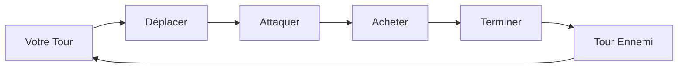
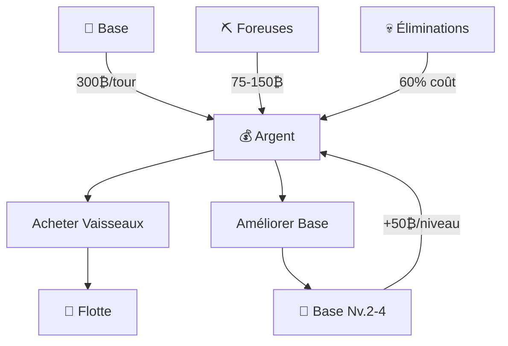
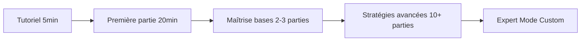

# 🌌 Présentation

Découvrez l'univers de **Xenon Space**, un jeu de stratégie spatiale au tour par tour où chaque décision compte.

## Qu'est-ce que Xenon Space ?

**Xenon Space** est un jeu de **stratégie spatiale au tour par tour** qui vous plonge dans une bataille galactique pour le contrôle de ressources cosmiques limitées. Commandez votre flotte, gérez votre économie et détruisez le vaisseau-mère ennemi !

:::info Genre
🎮 Stratégie au tour par tour | 🚀 Thème spatial | ⏱️ 15-45 minutes par partie
:::

---

## 🎯 Objectif du jeu

import { Card, CardContent } from '@theme/Card';

  

    

      

        <h3 className="hero__title">🏆 Victoire</h3>
        

          Détruisez le <strong>vaisseau-mère ennemi</strong> avant que le vôtre ne soit détruit !
        

      

    

  

  

    

      

        <h3 className="hero__title">💀 Défaite</h3>
        

          Si votre <strong>vaisseau-mère</strong> est détruit, la partie est perdue.
        

      

    

  

---

## 🎮 Caractéristiques principales

### ♟️ Stratégie au tour par tour

- ⏸️ **Prenez votre temps** - Pas de pression temporelle
- 🧠 **Planifiez** - Anticipez les mouvements ennemis
- 🎲 **Adaptez-vous** - Chaque partie est unique

---

### 🚀 Flotte variée - 5 types de vaisseaux

  

    

      

        
      

      

        <h4>🏃 Petit</h4>
        
<strong>Éclaireur rapide</strong>

        <ul>
          <li>✅ Très mobile</li>
          <li>✅ Peu coûteux (325₿)</li>
          <li>⚠️ Fragile</li>
        </ul>
      

    

  

  
  

    

      

        
      

      

        <h4>⚖️ Moyen</h4>
        
<strong>Polyvalent équilibré</strong>

        <ul>
          <li>✅ Bon équilibre</li>
          <li>✅ Portée correcte</li>
          <li>💰 Coût moyen (650₿)</li>
        </ul>
      

    

  

  
  

    

      

        
      

      

        <h4>🛡️ Lourd</h4>
        
<strong>Tank destructeur</strong>

        <ul>
          <li>✅ Très résistant</li>
          <li>✅ Dégâts élevés</li>
          <li>⚠️ Lent et cher (1050₿)</li>
        </ul>
      

    

  

  

    

      

        
      

      

        <h4>⛏️ Foreuse</h4>
        
<strong>Récolteur de ressources</strong>

        <ul>
          <li>✅ Mine astéroïdes (75₿)</li>
          <li>✅ Bonus planètes (150₿/tour)</li>
          <li>⚠️ Non-combattant</li>
          <li>💰 400₿</li>
        </ul>
      

    

  

  
  

    

      

        
      

      

        <h4>🚚 Transporteur</h4>
        
<strong>Déplacement tactique</strong>

        <ul>
          <li>✅ Transporte 3 vaisseaux</li>
          <li>✅ Mobilité stratégique</li>
          <li>💰 500₿</li>
        </ul>
      

    

  

:::tip Synergie
Combinez les vaisseaux intelligemment ! Par exemple : Transporteur + Foreuses = colonisation rapide de zones riches.
:::

---

### 🗺️ Cartes générées aléatoirement

Chaque partie se déroule sur une carte **unique** générée procéduralement :

| Élément | Description | Effet gameplay |
|---------|-------------|----------------|
| 🪐 **Planètes** | Grandes zones infranchissables | Bonus 150₿/tour pour foreuses adjacentes |
| ☄️ **Astéroïdes** | Obstacles minables | Rapportent 75₿ quand minés |
| 🌫️ **Atmosphères** | Zones autour planètes | Coût de déplacement doublé (2 pts) |
| ⬛ **Vide** | Espace libre | Déplacement normal (1 pt) |
| 🏰 **Bases** | Vaisseaux-mères | Zones de départ protégées |

:::info Personnalisation
Configurez le nombre de planètes (1-10) et d'astéroïdes (1-20) avant chaque partie !
:::

---

### 💰 Économie dynamique

**Sources de revenus :**
- 🏰 **Base** : 300-450₿/tour (selon niveau)
- ⛏️ **Minage astéroïdes** : 75₿
- 🪐 **Foreuses sur planètes** : +150₿/tour
- 💀 **Éliminations** : 60% du coût du vaisseau détruit

**Dépenses :**
- 🚀 **Vaisseaux** : 325-1050₿
- 🏰 **Améliorations base** : 1000-6000₿

:::tip Gestion économique
Investissez dans des foreuses tôt dans la partie pour un avantage économique durable !
:::

---

### 🎨 Interface futuriste

L'interface de Xenon Space vous plonge dans une ambiance **sci-fi** immersive :

**Éléments visuels :**
- ✨ **Effets holographiques** - Zones de déplacement/attaque
- 🌟 **Animations fluides** - Projectiles, explosions, rotations
- 💫 **Particules spatiales** - Étoiles, planètes animées
- 🎨 **Design néon** - Palette cyan/rouge/vert futuriste

**Audio :**
- 🎵 **Musique atmosphérique** - Ambiance spatiale
- 🔊 **Effets sonores** - Tirs, explosions, menu

:::note Style graphique
Inspiré de l'esthétique "space opera" avec des touches cyberpunk.
:::

---

## 🎯 Modes de jeu

### Mode Classique

Configuration équilibrée pour une partie standard :

| Paramètre | Valeur |
|-----------|--------|
| Planètes | 3 |
| Astéroïdes | 5 |
| Argent départ | 1000₿ |
| Niveau base | 1 |

**Recommandé pour :** Première partie, apprentissage

---

### Mode Personnalisé

Ajustez **tous les paramètres** à votre guise :

**Paramètres de carte :**
- 🪐 Nombre de planètes : 1-10
- ☄️ Nombre d'astéroïdes : 1-20

**Paramètres économiques :**
- 💰 Argent de départ : 500-5000₿
- 🏰 Niveau base initial : 1-5

**Paramètres avancés :**
- 📊 Statistiques des vaisseaux (PV, attaque, portées)
- 🎲 Mode aléatoire : génération procédurale complète

:::caution Mode Expert
La modification des stats des vaisseaux peut déséquilibrer le jeu. Utilisez avec précaution !
:::

---

## 👥 Public cible

Xenon Space s'adresse aux joueurs qui aiment :

  

    

      

        <h4>♟️ Stratégie</h4>
        
Fans de jeux comme :

        <ul>
          <li>Advance Wars</li>
          <li>XCOM</li>
          <li>Into the Breach</li>
          <li>Fire Emblem</li>
        </ul>
      

    

  

  
  

    

      

        <h4>🚀 Science-Fiction</h4>
        
Amateurs de :

        <ul>
          <li>Batailles spatiales</li>
          <li>Gestion de flotte</li>
          <li>Conquête galactique</li>
          <li>Univers futuristes</li>
        </ul>
      

    

  

**Niveau de difficulté :**
- 🟢 **Accessible** aux débutants (tutoriel intégré)
- 🟡 **Profondeur** pour les joueurs expérimentés
- 🔴 **Skill ceiling** élevé en mode personnalisé

**Durée d'une partie :**
- ⚡ Rapide : 15-20 minutes
- ⚖️ Moyenne : 25-35 minutes
- 🐌 Longue : 40-45 minutes

---

## 🏆 Système de succès

Débloquez des **succès** en accomplissant des objectifs :

| Succès | Description |
|--------|-------------|
| 🏆 Victoire Suprême | Remporter votre première victoire |
| 🗺️ Explorateur Cosmique | Parcourir toute la galaxie |
| 🚀 Maître de Flotte | Utiliser tous les types de vaisseaux |
| 🏰 Architecte Stellaire | Atteindre le niveau max de base |
| 💀 Chasseur d'Élite | Éliminer 10 vaisseaux ennemis |

:::tip Motivation
Les succès ajoutent des objectifs secondaires et augmentent la rejouabilité !
:::

---

## 🎓 Courbe d'apprentissage

**Progression recommandée :**
1. **5 min** - Comprendre les contrôles de base
2. **Partie 1** - Suivre le tutoriel intégré
3. **Parties 2-3** - Expérimenter les vaisseaux
4. **Parties 4-5** - Développer vos stratégies
5. **10+ parties** - Maîtriser les mécaniques avancées

---

## 🌟 Pourquoi jouer à Xenon Space ?

  

    <h3 className="hero__title">✨ Points forts</h3>
    

      

        <h4>🎮 Gameplay</h4>
        <ul>
          <li>Stratégique sans être complexe</li>
          <li>Parties courtes (15-45min)</li>
          <li>Rejouabilité infinie</li>
        </ul>
      

      

        <h4>🎨 Visuel</h4>
        <ul>
          <li>Interface futuriste</li>
          <li>Animations fluides</li>
          <li>Ambiance spatiale immersive</li>
        </ul>
      

      

        <h4>🆓 Gratuit</h4>
        <ul>
          <li>100% gratuit</li>
          <li>Pas de microtransactions</li>
          <li>Open source</li>
        </ul>
      

    

  

---

## 📸 Galerie

:::info Suggestions d'images
- `banner.png` - Image d'en-tête avec logo et vaisseau
- `logo.png` - Logo du jeu seul
- `menu-principal.png` - Capture du menu avec animations
- `partie-en-cours.png` - Vue d'ensemble d'une partie
- `bataille.png` - Affrontement de vaisseaux
- Pour chaque vaisseau : `petit.png`, `moyen.png`, `lourd.png`, `foreuse.png`, `transport.png`
:::

---

## 🎬 Prochaines étapes

  

    

      

        <h3>📖 Vous êtes prêt ?</h3>
      

      

        
Découvrez comment faire vos premiers pas dans le jeu !

        <a href="/premiers-pas" className="button button--primary button--lg">
          Commencer à jouer →
        </a>
      

    

  

