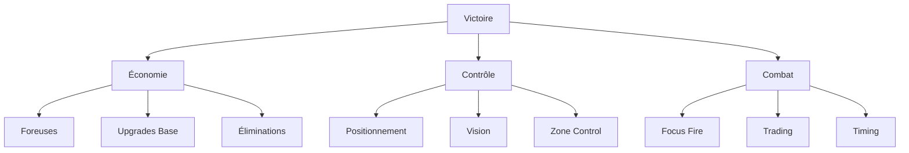
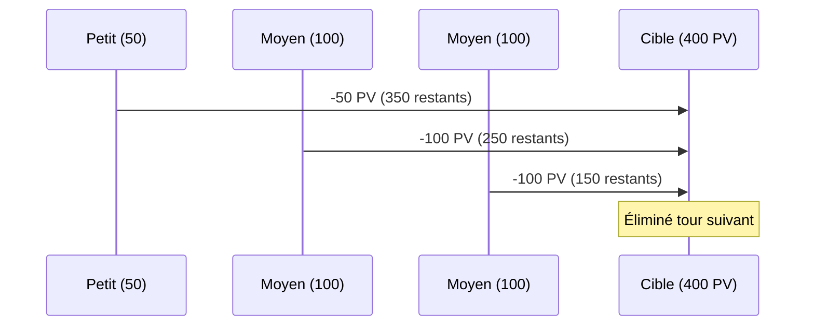
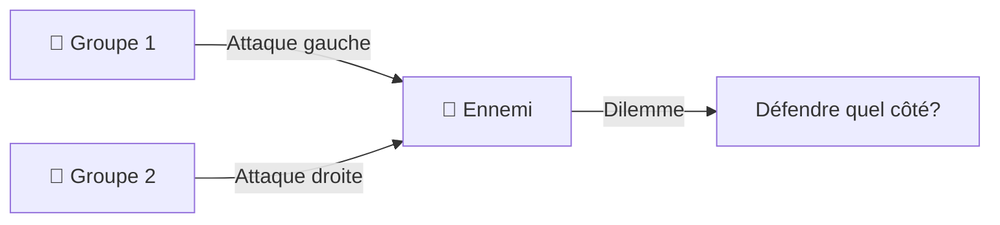
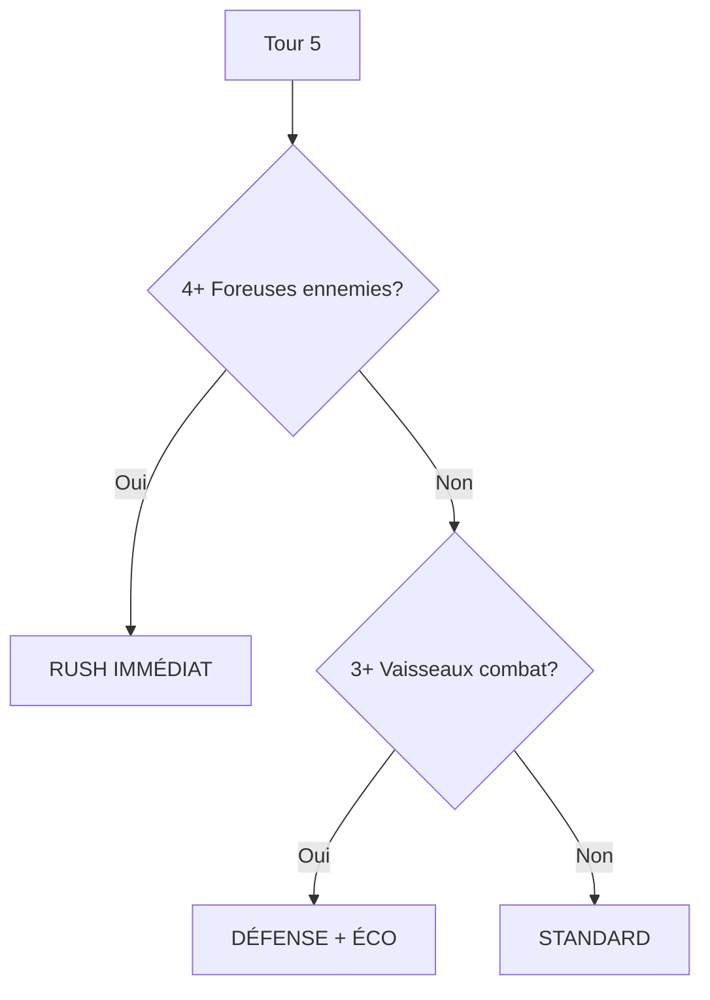

# 🧠 Stratégies

Guide des **stratégies avancées** et **tactiques** pour dominer dans Xenon Space.

---

## 🎯 Philosophies de jeu

### Les 3 piliers de la victoire



:::info Équilibre
Les joueurs qui excellent dans les **3 piliers** gagnent systématiquement.
:::

---

## 💰 Stratégies économiques

### Curve économique optimale

<Tabs>
  <TabItem value="aggressive" label="🔥 Aggressive" default>

**Objectif :** Domination rapide par le combat

**Build order :**
```
Tour 1-3 : 1 Foreuse (400₿)
Tour 4-6 : 3 Petits (975₿)
Tour 7-10 : 2 Moyens (1300₿)
Tour 11+ : Pression constante
```

**Avantages :**
- ✅ Victoire rapide si réussie
- ✅ Pression psychologique
- ✅ Récompenses éliminations

**Risques :**
- ❌ Économie fragile
- ❌ Pas de plan B
- ❌ Vulnérable au turtle

  </TabItem>
  
  <TabItem value="balanced" label="⚖️ Balanced">

**Objectif :** Équilibre éco/combat

**Build order :**
```
Tour 1-5 : 2 Foreuses (800₿)
Tour 6-10 : 2 Petits + 1 Moyen (1300₿)
Tour 11-15 : Upgrade Base Nv2 (1000₿)
Tour 16+ : Armée complète
```

**Avantages :**
- ✅ Polyvalence
- ✅ Adaptabilité
- ✅ Sécurité

**Neutral :** Pas de point faible majeur

  </TabItem>
  
  <TabItem value="greedy" label="💎 Greedy">

**Objectif :** Domination économique

**Build order :**
```
Tour 1-8 : 4 Foreuses (1600₿)
Tour 9-12 : Upgrade Base Nv2 (1000₿)
Tour 13-16 : Défense minimale
Tour 17+ : Armée massive
```

**Avantages :**
- ✅ Économie explosive
- ✅ Armée imbattable late game
- ✅ Upgrades base rapides

**Risques :**
- ❌ Vulnérable early/mid
- ❌ Nécessite micro parfaite
- ❌ Dépend de la map

  </TabItem>
</Tabs>

---

### Calculs de rentabilité

**Investissement vs Rendement :**

| Action | Coût | Gain/tour | ROI (tours) | Long terme |
|--------|------|-----------|-------------|------------|
| **Foreuse** | 400₿ | 150₿ | 2,67 | ⭐⭐⭐⭐⭐ |
| **Base Nv2** | 1000₿ | 50₿ | 20 | ⭐⭐⭐⭐ |
| **Base Nv3** | 2000₿ | 50₿ | 40 | ⭐⭐⭐ |
| **Base Nv4** | 6000₿ | 50₿ | 120 | ⭐ |

:::tip Optimisation
**Foreuses >> Base Nv2 >> Base Nv3 >> Base Nv4** en termes de ROI.
:::

---

## 🗺️ Contrôle de carte

### Zones stratégiques

```
Carte 50×30 divisée en 5 zones :

┌─────────────────────────────────┐
│ Zone 1   │   Zone 2  │  Zone 3  │  ← Avancée
│ (Base P1)│  (Centre) │ (Base P2)│
│          │           │          │
│  🏰────→  Contested  ←────🏰    │
│          │           │          │
│  Foreuses│  Combat   │ Foreuses │
└─────────────────────────────────┘
```

---

### Importance des planètes

**Tier list des planètes :**

<div className="row">
  <div className="col col--4">
    <div className="card">
      <div className="card__header" style={{background: '#FFD700'}}>
        <h4>🥇 Tier S</h4>
      </div>
      <div className="card__body">
        <p><strong>Centre de carte</strong></p>
        <ul>
          <li>✅ Équidistance bases</li>
          <li>✅ Contrôle stratégique</li>
          <li>✅ 150₿/tour</li>
        </ul>
      </div>
    </div>
  </div>
  
  <div className="col col--4">
    <div className="card">
      <div className="card__header" style={{background: '#C0C0C0'}}>
        <h4>🥈 Tier A</h4>
      </div>
      <div className="card__body">
        <p><strong>Près de votre base</strong></p>
        <ul>
          <li>✅ Sécurité élevée</li>
          <li>✅ Défendable</li>
          <li>✅ 150₿/tour</li>
        </ul>
      </div>
    </div>
  </div>
  
  <div className="col col--4">
    <div className="card">
      <div className="card__header" style={{background: '#CD7F32'}}>
        <h4>🥉 Tier B</h4>
      </div>
      <div className="card__body">
        <p><strong>Côté ennemi</strong></p>
        <ul>
          <li>⚠️ Risque élevé</li>
          <li>⚠️ Difficile à tenir</li>
          <li>✅ 150₿/tour si tenu</li>
        </ul>
      </div>
    </div>
  </div>
</div>

:::tip Stratégie
Sécurisez **vos planètes** d'abord, puis contestez le **centre**, enfin harcelez **l'ennemi**.
:::

---

### Vision et fog of war

**Il n'y a PAS de fog of war** dans Xenon Space, mais surveillez :

<div className="alert alert--warning">
  <h4>⚠️ Points de surveillance</h4>
  <ul>
    <li>🔍 <strong>Mouvements ennemis</strong> : Anticipez les attaques</li>
    <li>💰 <strong>Argent ennemi</strong> : Estimez ses achats potentiels</li>
    <li>❤️ <strong>PV base ennemie</strong> : Calculez tours pour victoire</li>
    <li>🚀 <strong>Composition flotte</strong> : Adaptez vos achats</li>
  </ul>
</div>

---

## ⚔️ Stratégies de combat

### Focus Fire (Concentration de tir)

**Principe :** Plusieurs vaisseaux attaquent **la même cible**.



**Avantages :**
- ✅ Réduit menace immédiatement
- ✅ Récupère récompense rapidement
- ✅ Simplifie le champ de bataille

:::danger Erreur courante
Attaquer **3 ennemis à 50%** au lieu d'**éliminer 1 ennemi** = erreur tactique !
:::

---

### Kiting (Hit and Run)

**Technique :** Attaquer puis reculer hors de portée.

**Exemple avec Petit :**

```
Tour 1 :
  Petit (6 dép, 3 att)
  ↓ Avance 3 cases
  🎯 Attaque (portée 3)
  
Tour 2 :
  ↑ Recule 6 cases
  Ennemi ne peut pas riposter !
```

**Conditions de succès :**
- ✅ Votre portée totale > Ennemie
- ✅ Espace pour reculer
- ✅ Pas encerclé

**Contre-mesures :**
- Utilisez vaisseaux lourds (portée 7)
- Coupez la retraite
- Acceptez les échanges

---

### Trading (Échanges calculés)

**Principe :** Sacrifier un vaisseau **peu cher** pour éliminer un **cher**.

<Tabs>
  <TabItem value="positif" label="✅ Trading Positif" default>

**Exemple :**
```
Vous : Petit (325₿)
Ennemi : Lourd (1050₿)

Calcul :
- Vous perdez : 325₿
- Ennemi perd : 1050₿
- Vous gagnez : 630₿ (récompense)

Bilan : +305₿ pour vous !
```

:::success Bon trade
Même en perdant un vaisseau, vous **gagnez économiquement**.
:::

  </TabItem>
  
  <TabItem value="negatif" label="❌ Trading Négatif">

**Exemple :**
```
Vous : Moyen (650₿)
Ennemi : Petit (325₿)

Calcul :
- Vous perdez : 650₿
- Ennemi perd : 325₿
- Vous gagnez : 195₿

Bilan : -455₿ pour vous !
```

:::danger Mauvais trade
Vous vous appauvrissez progressivement.
:::

  </TabItem>
  
  <TabItem value="calcul" label="📊 Formule">

**Calcul du trade :**

```
Bilan = (Coût_ennemi × 0.6) - Coût_vous

Si Bilan > 0 : ✅ Bon trade
Si Bilan = 0 : ⚖️ Neutre
Si Bilan < 0 : ❌ Mauvais trade
```

**Quick reference :**

| Vous perdez | Ennemi perd | Bilan |
|-------------|-------------|-------|
| Petit (325₿) | Lourd (1050₿) | ✅ +305₿ |
| Petit (325₿) | Moyen (650₿) | ✅ +65₿ |
| Moyen (650₿) | Lourd (1050₿) | ⚖️ +20₿ |
| Moyen (650₿) | Moyen (650₿) | ⚖️ -260₿ |

  </TabItem>
</Tabs>

---

### Zoning (Contrôle de zone)

**Technique :** Placer vos vaisseaux pour **interdire des zones** à l'ennemi.

**Setup défensif :**

```
Légende :
🏰 = Votre base
🛡️ = Lourd (portée 7)
⚖️ = Moyen (portée 5)
. = Zone contrôlée
X = Ennemi ne peut pas passer

Configuration :

  X X X X X X X
  X 🛡️ . . . . X
  X . ⚖️ 🏰 ⚖️ . X
  X . . 🏰 . . X
  X X X X X X X
```

**Principes :**
- Plus la portée est grande, plus la zone est étendue
- Superposez les zones pour combler les trous
- L'ennemi doit contourner ou combattre

---

### Pincer (Attaque en tenaille)

**Technique :** Attaquer de **deux côtés** simultanément.



**Avantages :**
- ✅ Force l'ennemi à se diviser
- ✅ Crée des ouvertures
- ✅ Maximise les dégâts

**Exécution :**
1. Diviser votre armée en 2 groupes
2. Contourner par les flancs
3. Attaquer simultanément

:::tip Avec Transporteur
Utilisez le transporteur pour **créer un deuxième front** rapidement !
:::

---

## 🎭 Stratégies psychologiques

### Bluff et intimidation

**Techniques :**

<div className="row">
  <div className="col col--6">

**🛡️ Démonstration de force**
- Montrer votre armée massive
- L'ennemi joue plus prudemment
- Vous gagnez du temps pour l'économie

  </div>
  <div className="col col--6">

**🏃 Fausse faiblesse**
- Cacher vos meilleurs vaisseaux
- L'ennemi attaque imprudemment
- Contre-attaque surprise

  </div>
</div>

---

### Tempo et rythme

**Contrôle du tempo :**

| Phase | Vous avez le tempo | Ennemi a le tempo |
|-------|-------------------|-------------------|
| **Early** | Harcèlement constant | Défense passive |
| **Mid** | Pression continue | Réactions |
| **Late** | Dictez engagements | Subissez combats |

:::tip Conseil
Celui qui **dicte le rythme** gagne souvent !
:::

---

## 🏆 Stratégies de victoire

### Rush (Victoire rapide)

**Plan de match :**

```
Tours 1-5 : Achats minimaux (2 Petits)
Tours 6-10 : Attaque base (ignorez économie)
Tours 11-15 : Push all-in

Objectif : Base ennemie détruite T15
```

**Conditions de succès :**
- ✅ Ennemi greedy (4+ foreuses)
- ✅ Map avec peu d'obstacles
- ✅ Exécution parfaite

**Risques :**
- ❌ Si échec, économie ruinée
- ❌ Ennemi turtle = défaite certaine

---

### Turtle (Défense → Domination)

**Plan de match :**

```
Tours 1-15 : 100% économie (foreuses + upgrades)
Tours 16-25 : Défense impénétrable
Tours 26+ : Armée massive → Victoire

Objectif : Économie 2× supérieure
```

**Conditions de succès :**
- ✅ Bon contrôle défensif
- ✅ Planètes près de votre base
- ✅ Patience

**Risques :**
- ❌ Vulnérable au rush early
- ❌ Partie très longue

---

### Snowball (Effet boule de neige)

**Plan de match :**

```
Tours 1-8 : Économie standard
Tours 9-15 : Premiers combats (trading positif)
Tours 16+ : Domination croissante

Chaque victoire → Plus d'argent → Plus de vaisseaux → Plus facile
```

**Clé :** Ne **jamais faire de mauvais trades**.

:::success Stratégie la plus fiable
Équilibrée, adaptable, et scalable.
:::

---

## 🎯 Builds par phase

### Early Game (Tours 1-10)

<Tabs>
  <TabItem value="standard" label="Standard" default>

**Objectif :** Poser les bases

**Build order :**
1. Tour 1 : Petit (325₿) - Exploration
2. Tour 2 : Foreuse (400₿) - Sur planète
3. Tour 3 : Petit (325₿) - Défense
4. Tour 5 : Foreuse (400₿) - Sur planète
5. Tour 7 : Moyen (650₿) - Combat
6. Tour 10 : Évaluer situation

**Argent restant T10 :** ~1500₿

  </TabItem>
  
  <TabItem value="rush" label="Rush">

**Objectif :** Pression maximale

**Build order :**
1. Tour 1 : Petit (325₿)
2. Tour 2 : Petit (325₿)
3. Tour 3 : Petit (325₿)
4. Tour 5 : Moyen (650₿)
5. Tour 7 : Moyen (650₿)
6. Tour 10 : PUSH

**Argent restant T10 :** ~500₿

  </TabItem>
  
  <TabItem value="greedy" label="Greedy">

**Objectif :** Économie explosive

**Build order :**
1. Tour 1 : Foreuse (400₿)
2. Tour 2 : Foreuse (400₿)
3. Tour 4 : Foreuse (400₿)
4. Tour 6 : Foreuse (400₿)
5. Tour 8 : Petit (325₿) - Défense minimale
6. Tour 10 : Upgrade Base Nv2

**Argent restant T10 :** ~2500₿

  </TabItem>
</Tabs>

---

### Mid Game (Tours 10-20)

**Objectif :** Établir domination

**Checklist :**
- [ ] 3-4 foreuses sur planètes
- [ ] Base niveau 2
- [ ] 5-6 vaisseaux de combat
- [ ] Aucun vaisseau ennemi près de votre base
- [ ] Contrôle du centre de carte

**Si checklist complète :** Vous êtes en position de force !

---

### Late Game (Tours 20+)

**Objectif :** Fermer la partie

**Stratégies de clôture :**

<div className="row">
  <div className="col col--6">
    <div className="card">
      <div className="card__header">
        <h4>🎯 Siège méthodique</h4>
      </div>
      <div className="card__body">
        <ol>
          <li>Éliminer la flotte ennemie</li>
          <li>Établir le siège (Lourds)</li>
          <li>Bombarder la base (200/tour)</li>
          <li>Victoire en 3-8 tours</li>
        </ol>
      </div>
    </div>
  </div>
  
  <div className="col col--6">
    <div className="card">
      <div className="card__header">
        <h4>⚡ Blitz final</h4>
      </div>
      <div className="card__body">
        <ol>
          <li>Rassembler toute l'armée</li>
          <li>Strike drop (transporteur)</li>
          <li>All-in sur la base</li>
          <li>Victoire ou défaite en 1-2 tours</li>
        </ol>
      </div>
    </div>
  </div>
</div>

---

## 🛡️ Contre-stratégies

### Comment contrer chaque stratégie

| Stratégie ennemie | Votre réponse | Clé de victoire |
|-------------------|---------------|-----------------|
| **Rush** | Turtle + Défense | Survivre 15 tours |
| **Turtle** | Rush ou Contrôle centre | Ne pas le laisser scale |
| **Snowball** | Éviter mauvais trades | Égalité économique |
| **Transport Drop** | Défense anti-drop | Garder vaisseaux arrière |

---

### Adapter son style

**Reconnaissance ennemie :**



:::tip Adaptabilité
Le meilleur joueur n'est pas celui avec **la meilleure stratégie**, mais celui qui **s'adapte le mieux** !
:::

---

## 📊 Métrique de performance

### KPIs (Indicateurs clés)

**Suivez ces métriques pour évaluer votre partie :**

| Métrique | Objectif T10 | Objectif T20 |
|----------|--------------|--------------|
| **Argent/tour** | 600₿+ | 1000₿+ |
| **Vaisseaux combat** | 4-5 | 8-10 |
| **Foreuses actives** | 2-3 | 3-4 |
| **Éliminations** | 1-2 | 4-6 |
| **PV base** | >80% | >60% |

:::info Auto-évaluation
Si vous atteignez ces objectifs, vous êtes **sur la voie de la victoire** !
:::

---

## 🎓 Exercices pratiques

<details>
<summary><strong>Exercice 1 :</strong> Trading Calculator</summary>

**Situation :**
Votre Moyen (400/400 PV) peut tuer un Lourd ennemi (100/800 PV).
Le Lourd peut vous tuer en 2 coups.

**Questions :**
1. Devez-vous attaquer ?
2. Quel est le bilan économique ?

**Réponses :**
1. ❌ Non ! Vous mourrez, mauvais trade.
2. Vous : -650₿ | Ennemi : -1050₿ + 390₿ = **-240₿ pour vous**

</details>

<details>
<summary><strong>Exercice 2 :</strong> Build Order</summary>

**Situation :**
Tour 1, vous avez 1000₿ de départ.

**Objectif :** Maximiser revenus Tour 10.

**Tentez un build order !**

<details>
<summary>Solution optimale</summary>

```
T1 : Foreuse (600₿ restants)
T2 : Foreuse (200₿ restants) - Revenus : 300₿/tour
T3 : Rien (500₿)
T4 : Rien (800₿) - Sur planètes
T5 : Foreuse (400₿) - Revenus : 600₿/tour
T7 : Foreuse (200₿) - Revenus : 750₿/tour
T10 : ~2000₿ disponibles

Argent Tour 10 : ~2000₿
Revenus : 750₿/tour
```

</details>

</details>

---

## 🏆 Checklist du joueur expert

<div className="alert alert--success">
  <h4>✅ Maîtrise complète si vous :</h4>
  <ul>
    <li>☑️ Calculez les trades mentalement</li>
    <li>☑️ Anticipez 3 tours à l'avance</li>
    <li>☑️ Adaptez build selon carte</li>
    <li>☑️ Utilisez le transporteur efficacement</li>
    <li>☑️ Maintenez >500₿ de réserve</li>
    <li>☑️ Ne perdez jamais une foreuse gratuitement</li>
    <li>☑️ Gagnez 60%+ de vos parties</li>
  </ul>
</div>

---

## 🔄 Prochaines étapes

<div className="hero hero--primary">
  <div className="container">
    <h3 className="hero__title">⚙️ Personnalisez votre expérience</h3>
    <p className="hero__subtitle">
      Découvrez tous les paramètres pour adapter le jeu à vos préférences !
    </p>
    <a href="/parametres" className="button button--secondary button--lg">
      Guide Paramètres →
    </a>
  </div>
</div>